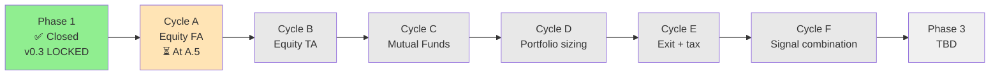
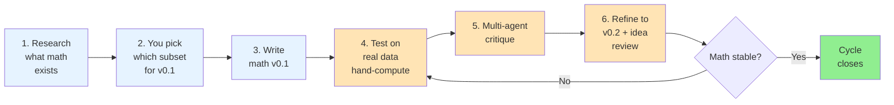
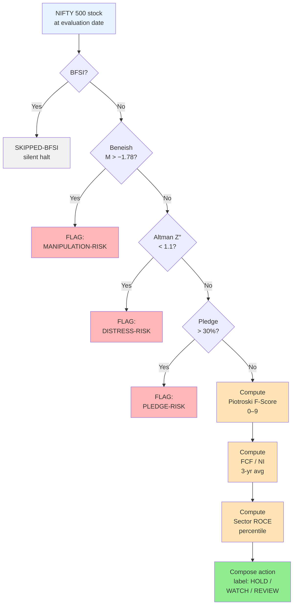
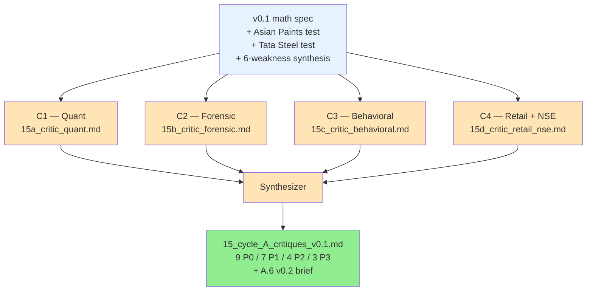

# Problem Statement — Dump 2

**Companion to**: `07_synthesis.md` (Dump 1)
**Date**: 2026-05-31 (end of Day 1.5, after Cycle A.5)
**Author**: Pranav + Claude
**Status**: Living document. Updated when Cycle A closes.
**Purpose**: A clean-English narrative of *what we did after Dump 1*, *what we learned*, and *where the problem statement might be heading*. Tables and diagrams included so the picture is legible at a glance.

---

## TL;DR

Since Dump 1 (`07_synthesis.md`), we locked the v0.3 problem statement, designed a 6-cycle Phase 2 (no implementation — just math + tests + critique), and executed the first cycle (Equity Fundamental Analysis) end-to-end through five sub-steps. The v0.1 FA math was empirically tested by hand-computing two real Indian companies (Asian Paints, Tata Steel) across four historical dates each. It failed in six identifiable, structural ways. Four independent critic agents then attacked the math from distinct lenses; all four returned the same verdict: **REFACTOR-REQUIRED**. The next step (A.6) is to write v0.2 of the math. The problem statement is mostly intact — one small clarification candidate for v0.4 (BFSI staging being made explicit). The 6-cycle process is working.

---

## 1. Where we are right now

| | |
|---|---|
| **Phase** | 2 (math + cycles) |
| **Cycle** | A — Equity Fundamental Analysis |
| **Last completed step** | A.5 — multi-agent critique of v0.1 math + tests |
| **Next step** | A.6 — refine math to v0.2 + idea-review trigger check |
| **Problem statement version** | v0.3 (LOCKED) — small candidate update to v0.4 surfaced (BFSI scope clarification) |
| **FA math version** | v0.1 (tested, broken in 6 ways) — to be refactored to v0.2 next |
| **Confidence in math** | LOW (math empirically wrong; fixes specified) |
| **Confidence in process** | HIGH (cycle structure produces real learning) |

---

## 2. The journey so far (clean English)

### 2.1 Phase 1 closed (Dump 1 → v0.3 lock)

`07_synthesis.md` (Dump 1) collected the 5 critique lenses on the initial problem statement and produced 12 questions for you to answer. You answered all 12 plus added three structural constraints (no trading/F&O — investments only; mutual funds added to the asset universe; staged paper → test-portfolio → live rollout). That gave us the v0.3 LOCKED problem statement in `08_decisions_locked.md`.

### 2.2 Phase 2 setup — the 6-cycle plan

After the v0.3 lock, I drafted `09_phase_2_plan.md`. The first draft was wrong — it had data-source design, architecture sketches, and UX specs as Phase 2 deliverables. You stopped me: *"do not jump to any kind of implementation. i just need to build plans, research, test, write the math, test again, review with multiple agents, build plan again."* I deleted those sub-tasks and rewrote the plan around a 6-cycle structure that stays purely in the math domain:

| Cycle | Scope | Status |
|---|---|---|
| **A** | Equity Fundamental Analysis | In progress (A.5 complete; A.6 next) |
| B | Equity Technical Analysis | Pending |
| C | Mutual Fund analytics | Pending |
| D | Portfolio construction & sizing | Pending |
| E | Exit rules + tax-aware math | Pending |
| F | Signal combination + behavioral metrics | Pending |

Each cycle runs the same 6-step pattern: research → user picks → write math v0.1 → test math v0.1 → multi-agent critique → refine to v0.2 (plus optional idea-review trigger that could bump the problem statement to v0.4 / v0.5).

### 2.3 Cycle A.1 — Equity FA research

One research agent surveyed the academic and NSE-specific evidence for fundamental analysis ratios and frameworks. Output: `10_cycle_A_research.md` (~4,200 words, 50+ citations). Key findings:

- **Piotroski F-Score** is the best-evidenced FA framework on NSE (two independent India replications).
- **Greenblatt Magic Formula** is contradicted in NSE evidence post-2012.
- **Coffee-Can criteria** documented precisely, but evidence is mostly Indian-popular-press rather than peer-reviewed.
- **Buffett moat screens** excluded — no NSE evidence base.

### 2.4 Cycle A.2 — You picked the v0.1 subset

You chose all my recommended defaults across 8 questions, locking the v0.1 math composition:

- Framework: **Piotroski F-Score only** (others deferred to v0.2)
- Estimates: **Trailing only**
- Banks: **BFSI flagged & skipped in v0.1**
- Sector percentile: **Absolute + note when N < 15**
- Manipulation / distress: **Beneish + Altman Z″ as knockout gates**
- Earnings quality: **FCF / Net Income (3-yr average) as overlay**
- Promoter pledge: **> 30% pledged = red flag (knockout)**

### 2.5 Cycle A.3 — v0.1 math written

I drafted `11_cycle_A_math_v0.1.md` directly (no agent — the math was clear from research). It specified:

1. The full pipeline (BFSI gate → Beneish → Altman Z″ → Pledge → Piotroski → FCF/NI overlay → Sector ROCE percentile → Action label)
2. Exact formulas (Beneish 8-variable formula, Altman Z″ EM variant, 9-signal Piotroski)
3. Thresholds (Beneish M > −1.78, Altman Z″ < 1.1, Pledge > 30%)
4. Composition rules for the four action labels (HOLD / WATCH / REVIEW / FLAG)
5. A worked example
6. What v0.1 explicitly does NOT do (deferral list)

### 2.6 Cycle A.4 — Hand-computation tests

You picked the strictest possible testing method: **hand-compute from annual reports**. Two stocks across four historical dates each (Mar-2020, Mar-2021, Mar-2022, Mar-2024):

- **Asian Paints** — chosen as a quality compounder archetype. Result: `12_cycle_A_test_v0.1.md` (745 lines, 36.8 KB).
- **Tata Steel** — chosen as a commodity cyclical archetype. Result: `13_cycle_A_test_v0.1_TataSteel.md` (1224 lines, 66 KB).

Both runs used a new checkpoint protocol (Write to disk after every logical step, run agents in background mode) — invented after a 55-minute agent run was lost on interrupt (Mistake M2 — see §7 below). The test synthesis is in `14_cycle_A_test_synthesis_v0.1.md` and surfaced **6 structural weaknesses** (see §5 below).

### 2.7 Cycle A.5 — Multi-agent critique

Four independent critic agents attacked the v0.1 math + tests from distinct lenses, then one synthesizer agent consolidated their work:

| Critic | Lens | Output |
|---|---|---|
| C1 | Quant / Statistician | `15a_critic_quant.md` |
| C2 | Forensic Accountant / Indian GAAP | `15b_critic_forensic.md` |
| C3 | Behavioral Finance | `15c_critic_behavioral.md` |
| C4 | Indian Retail Investor + NSE Specialist | `15d_critic_retail_nse.md` |
| S | Synthesizer | `15_cycle_A_critiques_v0.1.md` |

All four returned **REFACTOR-REQUIRED**. The synthesizer produced 9 P0 items, 7 P1 items, 4 P2 items, and 3 P3 items — plus a concrete A.6 brief for v0.2. Highlights in §8 below.

---

## 3. Artifact map (every file produced so far)

```
nefarious/
├── instruction.txt                          # Original prompt
├── LEARNINGS.md                             # Meta-record (mistakes, patterns)
├── RESUME.md                                # Bootstrap for fresh sessions
└── market_research/
    ├── CLAUDE.md                            # Project state + locked decisions
    ├── problem_statement.md                 # Original v0.1 debate doc (historical)
    ├── 01_research.md                       # Phase 1: market research
    ├── 02_critique_quant.md                 # Phase 1: quant lens
    ├── 03_critique_regulatory.md            # Phase 1: SEBI / regulatory lens
    ├── 04_critique_behavioral.md            # Phase 1: behavioral lens
    ├── 05_critique_product.md               # Phase 1: product/PMF lens
    ├── 06_critique_retail.md                # Phase 1: skeptical retail user
    ├── 07_synthesis.md                      # ⭐ DUMP 1 — Phase 1 synthesis + 12 Qs
    ├── 08_decisions_locked.md  🔒           # v0.3 LOCKED problem statement
    ├── 09_phase_2_plan.md                   # 6-cycle Phase 2 plan
    ├── 10_cycle_A_research.md               # A.1: FA research survey
    ├── 11_cycle_A_math_v0.1.md              # A.3: v0.1 math spec
    ├── 12_cycle_A_test_v0.1.md              # A.4 Phase 1A: Asian Paints test
    ├── 13_cycle_A_test_v0.1_TataSteel.md    # A.4 Phase 1B: Tata Steel test
    ├── 14_cycle_A_test_synthesis_v0.1.md    # A.4 synthesis: 6 weaknesses
    ├── 15a_critic_quant.md                  # A.5: Quant lens critique
    ├── 15b_critic_forensic.md               # A.5: Forensic accountant critique
    ├── 15c_critic_behavioral.md             # A.5: Behavioral finance critique
    ├── 15d_critic_retail_nse.md             # A.5: Indian retail + NSE critique
    ├── 15_cycle_A_critiques_v0.1.md         # A.5: Synthesizer consensus + A.6 brief
    ├── A5_plan.md                           # A.5 plan (lenses, prompts, structure)
    ├── problem_statement_dump_2.md          # ⭐ THIS FILE (Dump 2)
    └── sessionlogs/
        └── 2026-05-30-session-01.md         # Day 1 chronological log
```

---

## 4. The Phase 2 plan — visualized



Inside every cycle, the same 6-step loop runs:



---

## 5. v0.1 FA math pipeline — visualized

This is the math under test. Each step is either a knockout gate (halts the pipeline) or a primary signal / overlay (always computes and continues).



---

## 6. The six structural weaknesses (math learnings)

All six were surfaced by hand-computing v0.1 math on real NSE data. None were predictable from the literature alone.

| # | Weakness | Stock where surfaced | Severity | Why v0.1 was wrong | Proposed v0.2 fix |
|---|---|---|---|---|---|
| **W1** | Beneish false positives during regime shifts | Asian Paints Mar-2022 (FY2021 data) | **Critical** | DSRI + AQI co-move during liquidity crises (debtor-day stretch + cash parking); pandemic working-capital aberrations trip the gate | Two-stage conditional gate: hard halt only if M > −1.50 OR (M in [−1.78, −1.50] AND governance flag fires) |
| **W2** | Beneish false negatives for commodity firms | Tata Steel all 4 dates | **Critical** | Large non-cash charges (depreciation, impairments) make TATA term deeply negative; coefficient 4.679 dominates other indices and pulls M-Score below threshold permanently | Sector-conditional coefficient: 4.679 → 2.0 for heavy-asset sectors |
| **W3** | Piotroski F-Score anti-correlated with cyclical entry opportunity | Tata Steel Mar-2020 (F=5, +355% fwd) vs Mar-2021 (F=8, +34% fwd) | **Critical** | F-Score measures YoY change in level; for cyclicals this is recency tailwind, not regime position — strongest signal at peak (worst entry), weakest at trough (best entry) | Normalized 3-year average inputs (EBIT, margin, asset turnover) for CYCLICAL-tagged sectors; broader scope than just metals |
| **W4** | Ind AS 116 / accounting transitions break YoY signals | Asian Paints Mar-2020 F5 fail | High | Lease accounting (effective FY2020) moved operating leases on-balance-sheet, artificially inflating reported borrowings; affects F5, F6, F9, Beneish LVGI, Altman X1 | Regime-Shift Calendar — hard-coded lookup; exclude affected signals from F-Score denominator (don't zero them); also covers GST, demonetization, Ind AS 115/109 |
| **W5** | Altman Z″ dominated by century-accumulated reserves | Tata Steel all 4 dates (Z″ stayed 5.5–5.9) | High **→ escalated to Critical** by A.5 | X2 (Retained Earnings/TA) + X4' (Book Equity/TL) = 53–67% of variable Z″ contribution and rising; current-period leverage signals (Net Debt/EBITDA 6.7×) invisible | Universal: replace X2 with X2_current (NPAT_TTM/TA); replace X4' with Market Cap/TL. Plus three-metric composite for old/reserve-heavy firms |
| **W6** | Sector ROCE percentile fails on small sectors | Asian Paints all 4 dates (paints sector N < 10) | Medium | v0.1 rule silently hides percentile when N < 15; many high-quality Indian sectors are small by listed count (paints, specialty chemicals sub-sectors, defense electronics) | Use NSE Industry tier as primary for heterogeneous sectors (Chemicals, Healthcare, Consumer Durables); fallback to Sector tier; for N < 5 show "Rank N of M with peer ROCE values" |

**Meta-finding**: Trailing fundamentals cannot see forward disruptions (competitive entries, demand-cycle inflection, valuation mean-reversion). Asian Paints' 90× P/E in 2021 and the Birla Opus competitive entry — neither visible to v0.1. **FA alone is insufficient.** Other cycles (B for TA, F for signal combination) will need to address this.

---

## 7. Process learnings

The cycle process itself produced learnings — about how I work, how agents work, and what slows or breaks.

### 7.1 The five named mistakes (M1–M5)

| ID | Mistake | When | Cost | Correction |
|---|---|---|---|---|
| **M1** | Jumped to implementation-direction Phase 2 (data-source / architecture / UX specs) after locking v0.3 | After picking execution Mode D | ~30 min wasted; 3 infrastructure agents launched | You called it out (*"what are you doing?"*); deleted tasks 10–14; rewrote `09_phase_2_plan.md` with the cycle structure |
| **M2** | Spawned a 55-min foreground agent without checkpoint protocol or background mode | First A.4 attempt | 55 min of agent compute lost on interrupt | Invented checkpoint protocol; used `run_in_background: true`; reduced scope to 1 stock at a time |
| **M3** | After M2 interrupt, told you "the agent hasn't started — interrupted before it ran" when it had actually run 55 min | Immediately after M2 | Trust damage; you had to correct me | Verified filesystem; acknowledged the misread; reset task state honestly |
| **M4** | Spawned 3 infrastructure agents in parallel without showing prompts first for approval | Before M1 was caught | None (interrupted before output) | Now show/confirm before any non-trivial agent spawn |
| **M5** | Marked task #19 (A.4) complete after only Phase 1A (Asian Paints) — premature | After Asian Paints completed | Minor task-tracker inconsistency | Re-opened to in_progress, ran Phase 1B (Tata Steel), then marked complete |

**Pattern across all five**: moving too fast, over-committing, then having to revert. Going slower with explicit confirmation points avoids all of them.

### 7.2 The checkpoint protocol (invented after M2)

```
For any agent expected to run > 5 minutes:

1. Use run_in_background: true (chat isn't blocked; file is observable)
2. Agent must:
   a. Write a skeleton output file at start with status line:
      `🔄 Initialized — about to begin <task>`
   b. After EVERY major step (per ratio, per date, per section), overwrite
      the file with everything-so-far PLUS updated status line:
      `🔄 <current step in progress>`
   c. At end, status: `✅ All <X> complete.`
   d. Update "Last updated" timestamp every write
3. Pranav (or Claude) can `Read` the file mid-run to see live progress
4. If the agent dies, work up to the last checkpoint is preserved
```

This worked perfectly on Asian Paints (17 min, 25+ writes), Tata Steel (15 min, 1224-line file), and all 5 A.5 agents.

### 7.3 The multi-agent critique pattern

Parallel critics + synthesizer is a reusable pattern. Worked in Phase 1 (5 lenses on the problem statement) and in Phase 2 A.5 (4 lenses on v0.1 math). Forces consideration of failure modes that wouldn't surface from a single perspective. **Plan**: replicate this in B.5, C.5, D.5, E.5, F.5.

### 7.4 Two-account GitHub setup

Working from a Mac with two GitHub accounts (`peeveeee` personal, `DaiSwap` for this project), a global credential setup would break the personal account. Solved with a repo-local credential helper:

```bash
git config --local credential.helper ""
git config --local --add credential.helper "!gh auth git-credential"
```

This routes credentials only for this repo through `gh` (logged in as DaiSwap). Global config + macOS Keychain (peeveeee) untouched. **Reversible** with `--unset-all`.

### 7.5 Versioning conventions (locked early)

- Everything stays in **v0.X** during all of Phase 2. No v1.X anywhere.
- Problem statement: v0.1 → v0.2 → v0.3 (LOCKED, current) → v0.4 (per-cycle idea-review may bump)
- Math specs per cycle: v0.1 → v0.2 → v0.3 → ...
- File numbering: 10–17 = Cycle A, 20–27 = Cycle B, etc.
- New file per math version (not overwrite) so the v0.1 spec stays readable for posterity

---

## 8. A.5 critique synthesis — visualized + tabulated

### 8.1 The agent flow



### 8.2 Critic verdicts

| Critic | Verdict | One-line headline |
|---|---|---|
| C1 Quant | **REFACTOR-REQUIRED** | Pipeline sound; signals broken for ~35–40% of NIFTY 500 (metals, energy, cement, infra); two knockout gates are correlated, not independent |
| C2 Forensic | **REFACTOR-REQUIRED** | Ind AS context almost entirely absent; governance signals (auditor changes, restatements, RPTs) — the most reliable forensic indicators in SEBI history — are missing |
| C3 Behavioral | **REFACTOR-REQUIRED** | Math is broken at the **label layer**, not just the signal layer; no hysteresis; REVIEW is non-actionable; weekly cadence on quarterly signals causes harmful oscillation |
| C4 Retail + NSE | **REFACTOR-REQUIRED** | Silent BFSI skip is a broken product promise for any portfolio with banks; PSU class (~40–50 NIFTY 500 names) unaddressed; data-quality gaps silently corrupt mid-cap scores |
| **Synthesizer** | **REFACTOR-REQUIRED** | Unanimous. Pipeline structure is the one consensus strength; every gate, the primary signal, the label set, and the cadence all need targeted modification |

### 8.3 What v0.1 got right (consensus)

Three things consistently survived all four critic attacks:

1. **Pipeline architecture** (gate → primary → overlay → action label) is the correct design pattern.
2. **Consolidated financials** as the locked convention is correct for conglomerates (Tata Steel + Corus would be invisible on standalone).
3. **Promoter pledge gate** is the most India-specific addition and earns its place (no Western framework includes this).
4. **Reasoning string design** (traceable derivation per output) — labels with visible derivation are interrogable.
5. **BFSI exclusion logic** is correct (Piotroski/Beneish/Altman would produce meaningless outputs on banks); only the *silent* skip is wrong.
6. **Action label glossary** correctly distinguishes state description from instruction ("HOLD = no action needed", not "add more").
7. **ROCE as primary capital-efficiency metric** for NSE quality investing is the right choice (issue is peer-set implementation, not metric choice).

---

## 9. Where the problem statement might be heading — v0.4 candidates

This is the most important section. v0.3 is mostly intact. Only one candidate update has surfaced strongly from A.5, with several borderline cases worth flagging.

### 9.1 Strong candidate — BFSI staging made explicit (RECOMMENDED v0.4 edit)

**Current v0.3 wording (paragraph 8 of `08_decisions_locked.md`)**:
> "Asset universe: Direct equity: NIFTY 500 for fundamentals; NIFTY 100 restricted for TA signals in v1 (expand to NIFTY 500 in v2 after NSE-specific validation)"

**Issue surfaced in A.5** (Theme G + C4's verdict): The v0.3 statement says "NIFTY 500 for fundamentals" but the math v0.1 spec silently skips all BFSI companies (~35–40% of NIFTY 500 by market cap). For a real portfolio holding banks, this means the bot produces zero output for the largest sector. The math vs problem statement are out of sync.

**Proposed v0.4 addition** (one sentence):
> "Cycle A FA pipeline covers NIFTY 500 including BFSI; v0.2 delivers a BFSI stub (trend indicators: NIM, GNPA, PCR, CAR) with a full BFSI sub-pipeline scheduled for v0.3."

**Why this is worth a problem-statement edit, not just a math change**: It makes the staging visible to anyone reading the problem statement, instead of hidden in the math spec deferral list. This matters because the FA pipeline is supposed to cover NIFTY 500 — the BFSI stub is not a "nice-to-have" but a correctness obligation.

### 9.2 Borderline candidates — flagged for your decision

| ID | Candidate | What changes | Why borderline |
|---|---|---|---|
| **B1** | **Cadence clarification** | Add to Q9: "Weekly structured report, but individual modules update on their natural data trigger (FA = quarterly results / SEBI filing; TA = daily / weekly; MF = monthly NAV). Weekly report shows 'last updated' per module." | C3 and C4 push back on weekly cadence for FA. Math fix (delta-view + hysteresis) is achievable without problem-statement change. But making it explicit avoids the contradiction. |
| **B2** | **PSU treatment** | Add to scope: "PSUs run a partial pipeline with PSU-CONTEXT annotations; not silently skipped" | Math change is sufficient (Gate 0 in v0.2). Problem statement change would just acknowledge that PSUs need special handling. Optional. |
| **B3** | **Cyclical sector explicit handling** | Add: "Cyclical sectors (metals, energy, power, fertilizers, plus housing/auto-revenue-dominated companies) run cycle-position-aware FA — signals are not interpreted as quality without cycle context." | Same logic as B2 — math handles it via normalized inputs. Problem statement change is documentation, not requirement. |

**Recommendation on B1, B2, B3**: skip the v0.4 edit for these unless you want them documented at the problem-statement level for future contributors. The math layer (v0.2) is the right place to address them.

### 9.3 What is NOT changing

All 12 locked answers from `08_decisions_locked.md` plus the 3 structural updates remain intact:

| | v0.3 statement | A.5 impact |
|---|---|---|
| Q1 Horizon | (b) Pranav-only 3 months → PMF eval at 2026-08-30 | unchanged |
| Q2 Test portfolio | Staged: paper → test → live | unchanged |
| Q3 Exit rules | (c) Bot proposes default framework | unchanged (Cycle E) |
| Q4 Success metric | (d) Behavioral + Sharpe composite | unchanged |
| Q5 TA/FA conflict | (d) Context-sensitive prompt | unchanged |
| Q6 Sizing | (c) Direction + size + correlation | unchanged (Cycle D) |
| Q7 Sharing | (a) Never — strictly personal | unchanged |
| Q8 Data sources | (d) Kite + bhavcopy + AMFI | unchanged |
| Q9 Output format | (d) Structured report + chat drill-down | small clarification candidate (B1) |
| Q10 Entry framing | (c) Thesis-entry framing | unchanged |
| Q11 Tax | (a) LTCG/STCG in v1 — full feature | unchanged |
| Q12 Backtest gate | (b) Walk-forward, 3yr NSE, Sharpe > 0.3 | unchanged |
| Constraint X | No trading, no F&O — investments only | unchanged |
| Constraint Y | NSE equity + Indian MFs | unchanged |
| Constraint Z | Staged paper → test → live rollout | unchanged |

### 9.4 What this tells us about the cycle process

After one full cycle (A.1 → A.5), the problem statement v0.3 is **substantially intact**. Only one small explicit clarification surfaced (BFSI staging) and three borderline candidates that math handles. This is a positive process signal:

- The v0.3 problem statement is robust enough that cycle-level math work doesn't keep destabilizing it.
- The math layer is where the real iteration happens (v0.1 → v0.2).
- Future cycles (B–F) will each produce their own idea-review check. We may see more v0.4 candidates from Cycle B (TA) and Cycle C (MF) than from Cycle A.

---

## 10. The A.6 brief (what comes next)

Synthesizer produced a concrete A.6 brief. Headlines for the v0.2 refactor:

| Component | v0.1 → v0.2 change |
|---|---|
| **BFSI gate** | Keep exclusion logic; add minimum stub output (NIM, GNPA, PCR, CAR with trend labels) |
| **PSU gate** | NEW: Gate 0 before BFSI. Suppresses pledge gate; adds PSU-CONTEXT annotations; runs partial pipeline (ROCE + FCF/NI + F1/F3/F4 remain valid) |
| **Beneish gate** | Two-stage conditional halt. Sector-conditional TATA coefficient (4.679 → 2.0 for heavy-asset sectors). SGAI flagged as DATA-UNAVAILABLE rather than silent zero |
| **Governance Quality Screen** | NEW Gate 2.5: auditor change + restatement frequency + RPT > 15% + audit opinion. One flag = warn; two = halt |
| **Altman Z″** | Universal substitution: X2 → X2_current (NPAT_TTM/TA), X4' → Market Cap/TL. For old firms (>30 yrs or reserves > 200% EBITDA): add three-metric composite |
| **Promoter pledge** | Two-factor: absolute (>40%) + velocity (>10pp QoQ) + LTV context |
| **Piotroski for cyclicals** | Normalized 3-year average inputs (EBIT, margin, asset turnover) for CYCLICAL-tagged sectors. Broader cyclical tag list (includes housing/auto/construction-revenue companies) |
| **Regime-Shift Calendar** | NEW: hard-coded lookup table for FY2017–FY2020 transitions (demonetization, GST, Ind AS 115/109/116). Per-event signal exclusion from denominator (not zeroing) |
| **Sector ROCE percentile** | NSE Industry tier as primary for heterogeneous sectors; Sector tier for homogeneous; explicit peer display for N < 10 |
| **FCF / NI** | Cap at 3.0× for routing; switch to mean(OCF/NI) formula (averaging ratios, not ratio of averages); IMPAIRMENT-CHECK annotation above cap |
| **Action labels** | Add 2-quarter hysteresis on non-knockout transitions; REVIEW becomes structured checklist (which Piotroski group failed; nth-consecutive-quarter indicator; binary thesis question); WATCH gets cyclical-sector caveat where applicable |
| **Data-quality completeness** | Every output displays "X/N computed" with reason for any missing input |
| **Delta-view weekly report format** | Lead with "Changes this week" section; unchanged holdings get single table row; FA module shows "last updated [date]" |

---

## 11. Open questions / decisions you need to make

These are the decisions A.6 cannot make without you (full list with synthesizer's recommended defaults in `15_cycle_A_critiques_v0.1.md` §8).

| Q | Decision | Default recommendation | Why |
|---|---|---|---|
| **Q1** | Beneish gate design — two-stage / additive / two-period? | Two-stage conditional halt (C2's design) | Most precise; preserves hard halt for clear manipulators |
| **Q2** | Cyclical tag list breadth — narrow (metals/energy) / broader (+ construction/housing/auto) / broadest (+ chemical intermediates)? | Broader | Crompton/Astral class face the same anti-correlation; narrow tagging misses real cost |
| **Q3** | Altman Z″ replacement — X2_current only / composite for old firms / both? | Both | X2_current is universal low-risk; composite catches old-firm-reserve-domination cases |
| **Q4** | BFSI stub — qualitative trend cards / quantitative metrics / defer entirely? | Quantitative (NIM, GNPA, PCR, CAR with %) with "no formal FA score" disclaimer | More useful than IMPROVING/DETERIORATING; data is available |
| **Q5** | PSU gate — exclude / include with annotations / partial sub-pipeline? | Partial sub-pipeline | ROCE + FCF/NI + F1/F3/F4 are valid for PSUs; F5/F7 + pledge are not |
| **Q6** | AFFIRM label — add as 5th label / keep 4-label set? | Keep 4 for v0.2 | Already revising hysteresis + REVIEW; AFFIRM is scope creep, defer to v0.3 |
| **Q7** *(v0.4)* | BFSI staging clarification — add to problem statement? | YES — add one sentence to v0.4 | Aligns v0.3 wording (NIFTY 500) with math behavior (currently BFSI-skipped) |
| **Q8** *(v0.4)* | Cadence clarification — add to Q9 in problem statement? | NO — math layer handles it | Delta-view + hysteresis fix in v0.2 is sufficient |

---

## 12. Confidence — what we know vs what we're guessing

| Topic | Confidence | Why |
|---|---|---|
| **6 structural weaknesses (W1–W6) are real** | HIGH | Surfaced by hand-computation on 2 stocks × 4 dates each; all 4 A.5 critics confirmed independently |
| **P0 items in §10 (v0.2 changes)** | HIGH | Unanimous across critics; specific math prescriptions provided |
| **Two-stage Beneish threshold (−1.50)** | MEDIUM | Proposed value, not validated on NSE data. Empirical re-calibration on Indian manipulation cases (Vakrangee, Manpasand) would raise confidence |
| **Cyclical tag list (housing/auto/construction)** | MEDIUM | Logical extension; would benefit from a third test case (Crompton or Astral) before v0.3 |
| **"Accumulated reserves > 200% of EBITDA" trigger for composite Z″** | MEDIUM | Proposed threshold; uncalibrated |
| **P1 vs P2 ordering for new components** (Governance Screen, ADTV floor) | LOW | One-critic findings without corroborating test-data evidence |
| **v0.4 BFSI staging clarification is the right answer** | MEDIUM-HIGH | Math vs problem-statement misalignment is real; the specific wording is provisional |
| **Phase 2 6-cycle process is producing real learning** | HIGH | Test data > literature confidence; mistakes are surfacing early; multi-agent critique pattern works |

---

## 13. Process state at end of Cycle A.5

- **Phase 1**: closed (Dump 1 + v0.3 lock)
- **Phase 2 Cycle A**: A.1, A.2, A.3, A.4, A.5 all complete
- **Next**: A.6 — refine v0.1 → v0.2 math + idea-review check
- **After A.6**: Cycle A closes. Cycle B (Equity TA) begins.

**Mood**: Confidence in math = LOW (good — we know the weaknesses). Confidence in process = HIGH (good — we have a repeatable loop). One small problem-statement clarification candidate. No major shake-up.

---

## 14. How to read this doc (and Dump 1)

If you're reading these for the first time:
1. Read `07_synthesis.md` (Dump 1) — Phase 1 close + the 12 questions you answered
2. Read `08_decisions_locked.md` — your answers + the locked v0.3 problem statement
3. Read this file (Dump 2) — what's happened since
4. For math detail: `11_cycle_A_math_v0.1.md` (the math) + `14_cycle_A_test_synthesis_v0.1.md` (the 6 weaknesses)
5. For critique detail: `15_cycle_A_critiques_v0.1.md` (the synthesizer's full output with A.6 brief)

If you're picking up after a context clear: read `/Users/pranavvenkatesh/analytics/nefarious/RESUME.md` instead — it bootstraps a fresh Claude session into the project state.

---

**End of Dump 2.** Next update when Cycle A closes (after A.6) or when Phase 2 closes (end of Cycle F).
