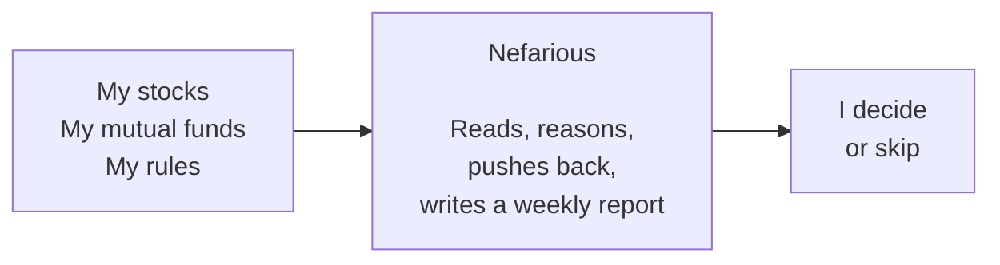

# I'm building an AI to argue with me about my own stock portfolio.

**Subtitle (for Medium)**: *I'm not trying to beat the market. I'm trying to stop getting in my own way — and learn a lot about investing and AI while I do it.*

**Tags (for Medium)**: Investing · Artificial Intelligence · Personal Finance · Behavioral Finance · India

**Target publication submission**: DataDrivenInvestor

---

## The dance every investor knows

Every investor has done this dance. You sell something a little too early and watch it triple over the next two years. You hold something a little too long because admitting you were wrong feels worse than losing forty percent of the money you put in. When the moment of deciding shows up, you're alone with it.

For Indian retail investors like me, it's harder. The tools tell us what's happening. They don't tell us what to do about it. Not in the context of *our* rules.

I've been thinking about this for months. I'm building something for myself, first. To get better at investing. To get better at using AI. And to figure out, slowly, whether the two can help each other.

---

## What today's AI is good at, and what it isn't

Today's AI — Claude, ChatGPT, Gemini — is a useful thinking partner. It writes well. It explains things clearly. For most knowledge work, it's the best tool we've ever had.

But ask it to look at your stock portfolio and tell you what to do, and you quickly hit a wall.

I tried this. I described my holdings to an AI and asked, point blank, "what should I do with these?" It told me things that were technically true and useless when it matters. "Reliance has been flat this year." Yes, I have eyes. "Maybe consider trimming if you're worried about concentration." Worried about what? Why? Against what benchmark? Based on which rule that *I* set?

The deeper issue isn't that AI is bad at this. It's that AI today is being built for general conversation. Not for thinking about *your* portfolio according to *your* rules across weeks and months.

That's fine. That's where the broad market is.

What I want is something narrower. Something that thinks alongside me, on the things I care about, using the rules I've set. AI is good at some things. I want to use it for the parts where it's good, and stay in charge of the parts where it isn't. And I want to learn a lot in the process — about investing, and about how to actually work with AI on something that matters to me.

---

## What I'm actually trying to solve

The list of problems I want this to solve is shorter and more personal than what most fintech apps promise.

I sell winners too early. I tell myself I'm "booking profits." I'm getting nervous.

I hold losers too long. Selling feels like admitting I was wrong.

I buy a stock based on someone else's thesis, and three months later I can't remember what *my* reason was supposed to be.

I have a dozen mutual funds I added over the years. I'm not sure which ones are still doing what I bought them to do.

My stop-loss rules exist on a sticky note. Sometimes I follow them. Sometimes I talk myself out of them.

The tools I have — Kite, screeners, news sites — tell me what's happening. Not what to do about it inside the context of my rules.

What I want is simpler than what most apps promise. Something that knows my portfolio and the rules I've set for it. One that explains itself in plain language, not just shows me numbers. One that pushes back when I'm drifting. One that helps me make fewer, better decisions.

Beating the market isn't the goal. Not getting in my own way is.

---

## What I'm building, in plain English

I'm calling it Nefarious. The name is a joke about how a bot watching your portfolio sounds. It's the opposite of what the name suggests. It's a planning assistant, not a trading bot, and not an advisor I'd ever sell to anyone.

Here's what it does.

It looks at the Indian stocks and mutual funds I own. It looks at the rules I've set for myself: when I'd sell, when I'd add, what I'd hold no matter what. Once a week, it writes me a short report. For each holding it tells me:

- Is the original reason I bought this still intact?
- Has anything important changed that I should know about?
- Am I stuck on the price I paid? Am I about to sell a winner because I'm anxious?
- For the mutual funds: are they still doing what I bought them to do? Has the manager left, fees crept up, or has the portfolio drifted into stocks I already own?
- If I sold something today, what would the tax actually cost me?

That's the core loop. It's intentionally narrow.

What it explicitly does *not* do:

It doesn't trade. No auto-execution. No order placement.

It doesn't predict the market. If the bot ever tells me anything confident about next week, I throw it out.

It doesn't replace my judgment. Every decision is mine. The bot just makes sure I'm making that decision against my own pre-stated rules, with the full picture in front of me.

It doesn't sell my data either. The whole thing runs on my own machine.

The hard rules I've set are simple. Indian markets only — NSE stocks and Indian mutual funds. No US stocks, no crypto, no derivatives, no day-trading. Long-term focus only. Any number the bot uses must be one I can check myself. And it's for me first. The whole project is built to figure out whether it actually helps me before I ever ask whether it might help anyone else.

---

## Why this problem statement makes sense

A few reasons, in plain English.

Most investing apps want me to do more. Log in, trade, react, repeat. That's how they earn. But the data on retail investors like me is pretty clear: more activity usually means worse outcomes. So I want to build something that helps me do *less* — fewer trades, fewer reactions, more thinking.

The behavioural mistakes are the expensive ones. When I look at how a portfolio actually does over years, the gap between average and good outcomes is almost never about which stocks I picked. It's about which mistakes I avoided. Panic selling. Holding through obvious problems. Getting hyped into a stock right before it broke. A tool that catches *those* mistakes, even when it gets things wrong sometimes, helps me more than picking a slightly better stock would.

I tested my own assumptions, and many of them were wrong. This is the most important reason. I started by writing down the math I thought a good investment assistant would use. Well-established formulas from finance textbooks, the kind you'll find referenced in every book on the subject. Then I tested them by hand on two real Indian companies. I picked them on purpose: one is a quality compounder, the other a commodity cyclical — businesses that go up and down with raw-material prices. Call them Company A and Company B. I worked through four historical points for each, the same way the textbooks said I should.

The math worked for Company A under normal conditions. For Company B, the standard "is this company financially healthy" signal pointed the wrong direction at every data point I tested. It looked strongest at the cycle peak — the worst time to buy. It looked weakest at the trough — exactly the moment that turned out to be the best entry of the decade. If I had built the bot trusting the textbook, it would have told me to buy Company B at the worst possible moments. That wasn't in the books most retail investors actually read. The only way I found it was to do the math, slowly, on real Indian data.

The point of all this isn't to win arguments with the AI. It's to be forced to think clearly. If I tell the bot "I think this stock is still cheap," and it lays out three reasons that might not be true, what matters isn't whether the bot is right. What matters is whether I can clearly say why I still believe what I believe. That's a different kind of help than what any tool I've used offers.

---

## Where I am, and what's next

A month in, I'm not at a finished product. I'm at: "I've learned, by testing, that a lot of standard investing math doesn't transfer cleanly to Indian companies." That's a useful thing to know early.

The next phase is fixing the parts that failed and adding the parts I haven't built yet. Reading price-and-volume signals. Mutual fund analysis. Position sizing. Exit rules that factor in Indian tax math. There's a long road.

I'm using Claude — Anthropic's AI — as my thinking partner throughout. If you're a retail investor in Indian markets and any of this resonated, I'd like to hear one thing: what's the one decision you keep making that you wish a tool would help you stop making? That's the kind of answer that shapes what I build next.

If you'd like to follow this build, I'll write more as it goes.

The work is mine. The accelerant is the AI.
