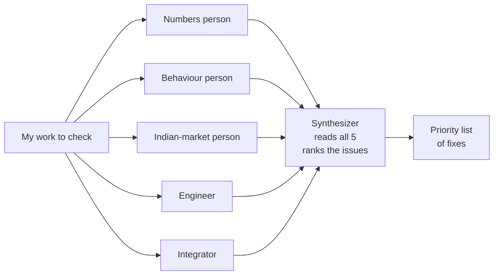

# One AI agrees with you. Five AIs catch your mistakes.

**Subtitle**: A technique for making AI push back harder — and what it found in my own investing math.

---

A few weeks ago I asked Claude to check my investing math. It told me everything looked fine. So I asked five different versions of Claude — each playing a different kind of expert — to look at the same work. Four of them disagreed with each other. One of them caught a bug in a risk-sizing formula that would have made things worse exactly when things got volatile.

That was the moment I realised I'd been using AI wrong.

---

## §1 — Why one AI just agrees with you

I'm building a small AI tool to argue with me about my own stock portfolio. The first post in this series explained why. This one is about a technique that's making it actually useful, and it took me a while to figure out.

Most people use AI by asking one question and trusting the answer. The AI doesn't push back unless you ask it to, and even when you ask, it gives polite "considerations" instead of "you're wrong, here's why." I noticed this when I asked it to check my work and it agreed. That was suspicious.

So I changed how I asked. Not by writing a smarter single prompt — by asking the same question five different ways at the same time, with five different framings.

---

## §2 — Five specialists, one question

The idea is simple. Instead of asking one expert, I ask five — each playing a different role. Each one gets the same input. Each one writes their review independently. Then a sixth one — the synthesizer — reads all five and produces a single priority list of what to fix.

The five roles I use:
- **The numbers person** — cares about whether the math is statistically sound
- **The behaviour person** — cares about how a real human will actually use this
- **The Indian-market person** — cares about things specific to investing here that Western frameworks miss
- **The engineer** — cares about whether this would survive in real use
- **The integrator** — cares about how this new thing connects to what I built earlier

The synthesizer doesn't have its own opinion. It reads the five reviews, finds where they overlap, where they conflict, and ranks what needs attention.

A round of this takes about an hour. Sometimes more.

---

## §3 — The bug one Claude missed

The first time I ran this on a piece of my investing math, the single-AI review I'd done earlier had said "looks fine." The five-role review came back with about twenty specific things wrong. Some were small. Three were the kind of finding I'd want to pay for.

**The numbers person caught a problem in a risk-sizing formula.** On the surface, the formula said "use a small position when volatility is high." Reading it carefully, it said "use a bigger position when volatility is high" — because of a small algebra error nobody had caught. If I'd kept going with that formula, my position sizes would have grown exactly when markets got rough. The opposite of what I wanted. I cannot say enough about how grateful I am for that catch.

**The Indian-market person caught a coverage gap.** About a third of the stocks I care about — the big banks and financial companies — were being silently skipped by my system. I knew this in theory. I'd forgotten how much of my actual portfolio that quietly excludes. A planning tool that ignores HDFC Bank and ICICI for me is not really a planning tool.

**The integrator caught the strangest one.** Two parts of my system that I'd built separately — one looking at fundamentals, one looking at price action — were behaving like two sensors measuring the same underlying thing. They both lagged the same market signal from underneath. When I combined them, I expected confirmation. I got an echo instead. The combination was worse than either part alone for one specific kind of stock.

One review I want to mention because it didn't pan out: the behaviour person flagged that my system's alerts were "too anxious" — too many warnings, the user would tune them out. When I checked the actual alert frequency, the reviewer had assumed a much higher cadence than the real one. False alarm. But useful — it forced me to write down what cadence I was actually assuming, which I'd never done.

So: out of about twenty findings, maybe four were big. Several were small. One was wrong. That's a real catch rate for an hour of work.

---

## §4 — Why this works

A single AI gives you something like an average answer. When you ask it to play a specific role, it pulls from a narrower slice of what it knows — more opinionated, more pointed. Five roles, five different slices, five different things they're looking for.

The synthesizer is what keeps it useful. Without that step, you'd get five conflicting reviews and no decision. With it, you get a ranked list with reasons for each item.

This isn't a new technique. AI researchers call versions of it debate, jury, mixture-of-agents. I'm not implementing those papers — I'm just using a rough version of the same idea for personal work. The looser version still seems to help.

---

## §5 — What I've taken from working this way

Two things I've taken from doing this for a few months. The first is that AI is most useful as a critic, not as a writer. I kept defaulting to "write the analysis for me" and getting bland output I'd then have to argue with. Switching the prompt to "critique what I wrote" produced sharper results, faster. I think the reason is that writing requires opinions; critiquing only requires noticing.

The second is messier. Making the AI play a specific role catches things that asking a generic question doesn't. But I'm still figuring out where this stops working — there are clearly cases where the role I pick changes very little, and other cases where the right role catches something nothing else would. I don't yet have a rule for which is which.

I'm using this for non-investing things too now. Slower than just asking, but the catches are real.

---

## §6 — What this is for

I started this project to learn, not to ship a product. The multi-role critique loop is teaching me about working with AI when something is actually at stake. Each round surfaces something I didn't know I didn't know.

**Next post**: one of the actual findings the critics pushed me toward. A famous investing checklist that, on the data I tested, gave me the opposite of the right answer for one kind of Indian stock. I'm still digging into it.

If you've tried multi-agent critique on your own work, I'd be curious what you found. Especially the parts where it stopped helping.
