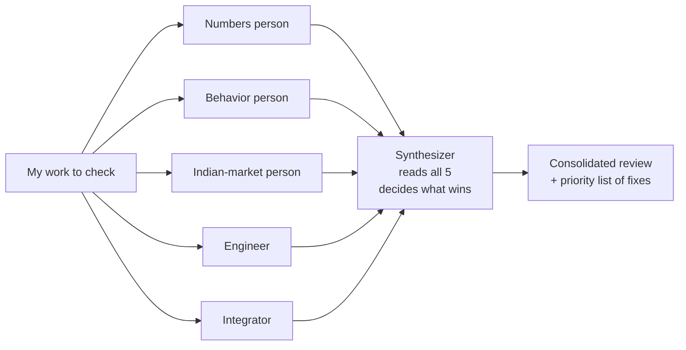
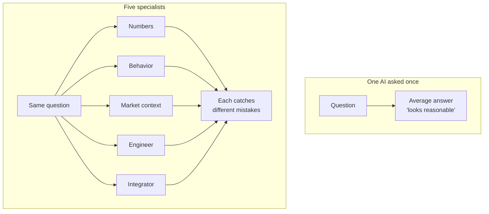

# Blog Post #2 — Plan

**Working title (3 candidates, pick one)**:
1. **"How I taught my AI to argue with itself"** (recommended — playful continuation of blog #1's title)
2. "One AI agrees with you. Five AIs catch your mistakes."
3. "Why I stopped trusting one AI for one answer"

**Audience**: Same as blog #1 — Indian retail investors who use AI tools (ChatGPT, Claude, Gemini). Secondary audience: people building AI tools, who'll appreciate the methodology.

**Length target**: 1500–1800 words (~7–8 min read).

**Voice constraints (from blog #1 learnings + Pranav's feedback on this plan)**:
- First person — "I asked Claude to review my work" / "Here's what happened"
- Simple English. No "phases", "cycles", "v0.X", "iteration N". Just "the first thing I built", "the next round of review", "the finding that came back".
- Real company names → variables (Stock X / Company Y) wherever they show up.
- Diagrams in mermaid (no ASCII art, no plain-text tables for visualization).
- No defensive framing ("no one is building this"). Personal learning frame ("I'm doing this to get better at investing").
- **🔑 TONE — "still learning, not done" (locked from Pranav feedback)**: The post must NOT sound like "I figured this out, here's the answer." It should sound like "I'm trying this, here's what I'm seeing so far, would love input." Sentence-level cues throughout: "I think", "early signs", "I'm still figuring out", "open to feedback", "would love to hear from anyone who's tried this differently". Avoid: "this works", "the answer is", "the right approach is".

---

## The one thing this blog should leave the reader with

> **When AI agrees with you, you've learned nothing. The trick is to make it disagree — with itself.**

That's the takeaway. Everything else is in service of that.

---

## The hook (first 100 words — must land in 4 sentences)

Draft (will refine in v0.2):

> A few weeks ago I asked Claude to check my investing math.
> It told me my math was fine.
> Then I asked five different versions of Claude — each pretending to be a different kind of expert — to check the same math.
> Four of them disagreed with each other. One of them caught a bug that would have lost me real money.

That's the lede. The next paragraph zooms out: "I'm building an AI to argue with me about my portfolio. This is the technique that's making it actually useful."

Link back to blog #1: a single sentence. "If you missed why I'm doing this, [the first post] explains it."

---

## Structure (6 sections)

### §1 — The problem with asking one AI for one answer (~250 words)
- Most people ask one AI one question and trust the answer.
- The AI doesn't push back unless you ask it to.
- Even when you ask, it gives polite "considerations" — not "you're wrong, here's why".
- I noticed this when I asked it to check my investing math: it agreed.
- That was suspicious. So I changed how I asked.

### §2 — The setup: five specialists, one question (~300 words)
- Instead of asking one expert, I ask five — each pretending to be a different kind of person:
  - **The numbers person** (cares only about whether the math is statistically right)
  - **The behavior person** (cares about how a real human would use this)
  - **The Indian-market person** (cares about things Western frameworks miss — the things specific to investing here)
  - **The engineer** (cares about whether this would actually run in production)
  - **The integrator** (cares about how this new thing connects to what I built earlier)
- Each one gets the same input. Each one writes their review independently.
- Then a sixth one (the synthesizer) reads all five and decides who's right when they disagree.

**Diagram 1**: Mermaid fan-out diagram:

### §3 — What changed when I started doing this (~300 words)
- Single-AI review: "looks good".
- Five-AI review: average of **20+ specific things wrong**.
- Show this concretely with a real-from-my-work example (anonymized):
  - The numbers person caught a **dangerous bug** in a formula a different reviewer had just OK'd. The bug would have made my position size go UP when volatility went UP — the exact opposite of what I wanted. (B-W5 ATR stop bug from B.5 Quant critic — anonymized as "a risk-sizing formula".)
  - The Indian-market person caught that a large slice of the stocks I care about (banks, financial companies) were silently skipped by my system. About **a third of my actual investable universe** was missing. (B-W6 BFSI gap — anonymized as "the big financial-stocks gap".)
  - The integrator caught that two different parts of my system, when combined, were **worse** than either part alone for a specific kind of stock — because they were repeating the same lagging signal, not adding independent information. (B-W1 cross-cycle compounding — anonymized.)
- None of these would have surfaced from one AI looking at the same work.

### §4 — Why this works (the principle) (~250 words)
- One AI is trained on a giant average of the internet. It tends to give the average answer.
- When you ask it to play a specific role, it pulls from a narrower, more opinionated slice of its training.
- Five roles = five different slices. Different slices catch different things.
- The synthesizer is the trick — without it, you'd just get five conflicting reviews and no decision.
- Bonus: forcing the AI to commit to a verdict (ACCEPT / NEEDS REWORK / REJECT) makes it less mushy. "There are some considerations" becomes "this is broken because X".

**Diagram 2**: Mermaid flowchart showing the "1 AI = average opinion" vs "5 specialists = different opinions" idea visually. Maybe a Venn-diagram-style representation if mermaid supports it (or a side-by-side comparison flowchart).

### §5 — What I learned about working with AI this way (~250 words)
- AI is best as a critic, not as a writer.
- It's most useful when you make it disagree with itself.
- Pretending to be a specific kind of expert is more useful than just asking "what do you think?".
- A synthesis step is non-negotiable. Without it, you drown in conflicting opinions.
- The cost is: more rounds, more time. The benefit is: real catches, not vibes.
- I'm using this same pattern for everything serious now — not just investing.

### §6 — What this means for my project (~150 words)
- The bigger picture: I'm not building an investing system as a product. I'm building it to learn — and the multi-AI-critique loop is teaching me more than the work itself.
- Each round surfaces something I didn't know I didn't know.
- The investing math is getting better, but the bigger learning is about how to work with AI when the stakes matter.
- Soft-honest framing: "I'm still working out where this technique works best and where it doesn't. If you've tried something similar, I'd love to hear what you found."
- **Closing teaser to Blog #3 (LOCKED in from Pranav feedback)**: "Next post: one of the actual findings the critics surfaced — a number from a famous investing checklist that, on the data I tested, gave the opposite of the right answer for an entire kind of Indian stock. I'm still investigating, but the pattern is striking enough that I want to share it."

---

## Diagrams needed (mermaid, kept simple)

| # | Where | What | Style |
|---|---|---|---|
| 1 | §2 | Five-critic fan-out + synthesizer | Flowchart LR |
| 2 | §4 | One-AI vs Five-AI comparison | Flowchart TB with two subgraphs |

That's it. Two diagrams. The post is content-heavy, not visual-heavy.

---

## Examples to use (all anonymized)

| Example | What it shows | How to anonymize |
|---|---|---|
| Quant critic catching the B-W5 ATR stop bug (B.5) | A real safety catch that one AI would have missed | "a risk-sizing formula that, on closer reading, would have made things worse when things got volatile" |
| Retail+NSE critic catching the BFSI gap (B-W6) | Why specialist roles matter | "about a third of the big Indian companies I actually care about were being silently skipped by the system" |
| Cross-cycle critic catching compounding (B-W1) | The integrator role's unique value | "two independent parts of my system, when combined, were worse than either part alone — because they were both reading the same delayed signal from underneath" |

No company names. No specific math. Just the pattern.

---

## What success looks like

If someone reads this and:
- Tries the "five-roles + synthesizer" pattern on their own work next week → win
- Stops trusting single-AI answers without verification → win
- Recommends it to a friend who's overusing ChatGPT → win

If they think it's a deep AI methodology paper → fail (it's not — keep it accessible).

---

## Risks / things to watch

- **Too process-y**: a post about methodology can feel dry. The opening hook + concrete examples need to do the work.
- **Inside-baseball**: avoid "agent prompts", "tool use", "background mode", "checkpoint protocol". The reader doesn't need to know how it's implemented; they need to know what the pattern is.
- **Self-congratulatory**: "look how clever I am" is the wrong tone. The hook is "I noticed AI was just agreeing with me; I had to trick it into pushing back".
- **Over-anonymized**: variables can feel cold. Use them only for company names. Use first-person and specific situations everywhere else.
- **Pretending it's new**: this technique is widely used in AI research (debate, jury, MoA). I'll add a one-line "I didn't invent this — researchers call it AI debate or jury — but I learned it works for personal use too".

---

## What I want Pranav to review in this plan

1. **Title pick** — recommend (1) "How I taught my AI to argue with itself", or override.
2. **Hook draft** — does the 4-sentence lede land?
3. **Structure** — 6 sections feels right; cut/merge anything?
4. **Examples** — happy with the 3 anonymized examples from B.5? Or want to use older ones from blog #1's era?
5. **Closing teaser** to blog #3 — yes or save the teaser for after blog #3 plan is locked?
6. **Length** — 1500-1800 OK or want tighter (1200) / longer (2000)?

Once locked, I'll spawn 5 critic agents (same lenses as blog #1: target reader / editorial / skeptic / voice authenticity / Medium-fit) to review this plan + the eventual draft.
