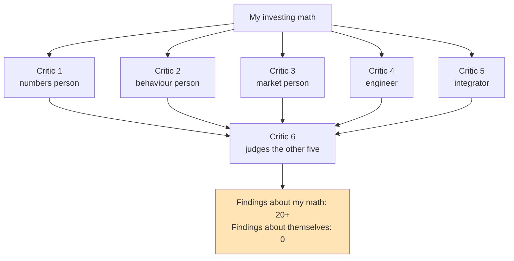
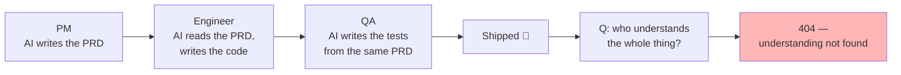
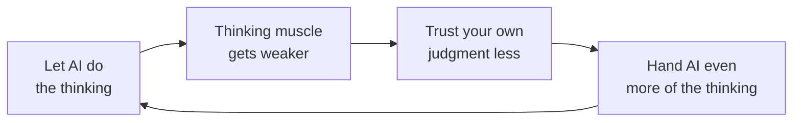
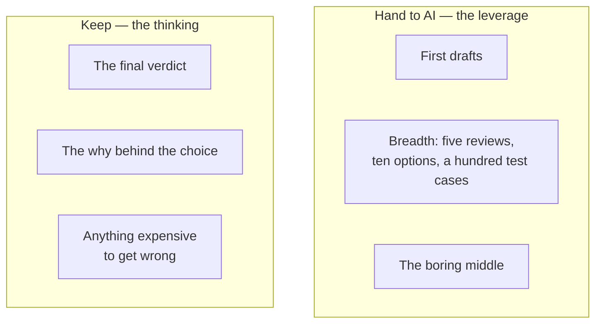

# Blog Post #3 — Draft (PUBLISHED)

**Status**: ✅ Published 2026-06-10 — https://medium.com/@DaiSwap/everyone-can-use-ai-almost-nobody-knows-when-not-to-4b000183b334
**Final title**: "Everyone can use AI. Almost nobody knows when not to."

> **META — delete this block before publishing**
>
> **Title — Pranav to pick (all built on the ending's theme)**:
> 1. *Output is cheap now. Judgment isn't.* ← recommended
> 2. *Everyone can use AI. Almost nobody knows when not to.*
> 3. *It looks right. That's exactly the problem.*
> 4. *AI made your work look perfect. Do you know if it's right?*
> 5. *Use AI for the leverage. Keep the thinking.* (stays as the post's closing line regardless)
>
> **Subtitle**: *I built five AI agents to check my work. One human comment caught what all five missed.*
>
> **Tags (5)**: Artificial Intelligence, Future Of Work, Productivity, Critical Thinking, Technology
>
> **Diagrams**: 4 inline (mermaid — Notion renders these natively; for Medium, screenshot/export each as PNG). One optional extra in the appendix at the bottom. Prune freely — the post works with any two.
>
> **Links used**: Blog #1 and Blog #2 URLs are embedded inline where marked.

---

# Use AI for the leverage. Keep the thinking.

*I built five AI agents to check my work. One human comment caught what all five missed.*

Say you're building an AI agent. You need to check that its output is right. So you do what most teams do now: you use another AI to check it.

Look at that loop for a second. The thing that made the work is a model. The thing checking the work is a model. Neither one knows what "right" looks like. And because the output reads polished, the human in the middle doesn't feel the need to look closer. When both sides of a loop are probabilistic, errors don't cancel out. They compound.

I'm not describing a hypothetical. I'm describing something I did. In public. In [my last post](https://medium.com/@DaiSwap/one-ai-agent-agrees-with-you-five-agents-catch-your-mistakes-255e3ce606b9).

## Speed became the only goal

I've been noticing something at work, and the more I see it, the more convinced I am that we're walking into a problem with our eyes open.

Everyone around me is using AI to move faster. I do too — my whole side project runs on it. But somewhere along the way, speed quietly became the only goal, and we stopped asking what we're trading away for it.

The clearest example of what we're trading away is that loop above. And I know it's the clearest example because I built one, felt great about it, and got corrected by a stranger on the internet.

## The bug none of my five agents could find

A few months ago I started [building an AI to argue with me about my own stock portfolio](https://medium.com/@DaiSwap/im-building-an-ai-to-argue-with-me-about-my-own-stock-portfolio-e613a279e628). Not to pick stocks. To push back on my decisions before I act on them.

Along the way I got proud of one technique and wrote a whole post about it: instead of asking one AI to review my work, I ask five, each playing a different specialist, and then a sixth one reads all five reviews and ranks what needs fixing.

And it worked — it caught real things. A bug in a risk-sizing formula that would have made my positions grow exactly when markets got violent. A blind spot where a third of the stocks I care about were being silently skipped. Twenty-plus findings landed every review round. Reading them felt like standing in front of a panel.

Then a reader left a comment on that post. A long, thoughtful one. Genuinely one of the most helpful things anyone has done for this project.

The point of it was simple. All five of my critics run on the same underlying model. Same training data, same habits, same blind spots. Dressing one model up in five different roles changes its vocabulary, not its reasoning. And my sixth agent, the one that "judges" the five reviews? Same model again. Reading its own output. Nodding along.

One model, arguing with itself in five voices. And me, feeling thorough the whole time.

Here's the detail that stays with me. Across every round that pipeline ever ran — twenty-plus findings each time — not one finding was ever "all five of us share the same blind spots." The system could not see the one thing about itself that a human reader spotted in minutes.

That is what "AI validating AI" actually means. Nobody in the loop has ground truth. The polish just hides it.



*Six agents. One model. Zero mirrors.*

(Small aside for readers of the last post: I had promised a follow-up about a famous investing checklist. I shelved that draft. When I finally sat down and read it as a reader instead of as its builder, I didn't believe it enough to publish. Hold that thought — it's where this post is heading.)

## Who actually understands what was built?

It gets worse when you zoom out to how teams actually ship things now.

A product manager uses AI to write the long, exhaustive PRD. The engineer uses AI to read that PRD and write the code. The QA team uses AI to generate test cases from the same PRD. At the end of this chain, ask a simple question: who on this team actually understands every requirement and knows, in detail, what was built?

Often, nobody. Not because people are lazy, but because AI produces so much output, so fast, that reviewing all of it in its entirety is practically impossible. So we skim. We approve. We move on. The understanding that used to live in a human head now lives nowhere at all. It's distributed across a chain of model outputs that no single person has fully read.



That's not efficiency. That's speed running on borrowed understanding, and the debt comes due at the worst possible time. In production. In front of a customer. In an edge case nobody thought about, because nobody was really thinking.

The same chain runs in investing, by the way. A screener produces the shortlist, an AI summarizes the filings, the buy decision gets made — and nobody in that chain ever opened the annual report.

## Averaged out

And this isn't just a tech problem.

Look at content. The internet is filling up with writing that is technically fine and completely forgettable. Same structure, same tone, same safe conclusions. When everyone draws from the same models trained on the same data, the outputs converge. Originality doesn't die dramatically. It just gets averaged out.

The creators who stand out now are increasingly the ones whose work feels unmistakably human. A specific experience. An unusual opinion. A voice you couldn't have prompted your way into.

## The muscle

You can see early versions of this everywhere. Students who let AI write their essays and can't defend a single argument in them. Candidates who polish their résumés with AI and can't justify a single bullet point in the interview. Designers who generate ten options in a minute and can't explain why any of them is right. Analysts who present AI-written summaries of reports they never opened.

None of these people got less capable overnight. They just stopped exercising the muscle. Critical thinking is exactly that — a muscle. It doesn't disappear when you use AI. It disappears when you stop doing the thinking yourself.



*The only gym where you lose the muscle by outsourcing the reps.*

## What I kept, and what I still hand over

So what did I actually change after that comment?

Less than you might expect, and more than it looks.

I still run the five agents. That part, the reader didn't kill — and I'd defend it. Five angles on my work surface things I would never find alone, and the agents don't get tired, bored, or attached to their own earlier opinions the way I do. Breadth is exactly what machines are good at. I hand over breadth happily.

What changed is what happens after. Every findings list now ends with me — slowly, with coffee, often disagreeing. In my experience, roughly one in ten of those confident, well-worded findings turns out to be wrong. Plausible, fluent, wrong. Sorting the real ones from the confident-but-wrong ones is not overhead on top of the work. It is the work. It's the exact part I had almost handed away.

And I keep one more category for myself, fiercely: anything where being wrong is expensive. For me, that's the final buy-or-sell judgment my whole project exists to inform. For you it might be the architecture decision, the diagnosis, the hire, the paragraph that carries your name. The test is simple: if the cost of being wrong lands on you, the thinking should happen in you.



One new habit too, and it costs nothing: whenever something checks my work — a model, a process, a checklist — I now ask what the checker *can't* see. A model checking a model can't see their shared blind spots. Asking that question is free. Not asking it is how I ended up needing a stranger's comment to find the hole in my own system.

## Where this goes

So here is what I strongly believe about where this is heading.

In a world where AI-generated output is abundant and nearly free, the valued thing will be the opposite. Judgment. Original perspective. Original thinking. The ability to look at something and know whether it's actually right, not just whether it looks right. Deep understanding of what you built, and why.

Tomorrow's premium skill (honestly, today's already) won't be knowing how to use AI. The premium skill will be knowing which parts of your work are the parts where your own thinking is the whole point (validation, judgment calls, original ideas, anything where being wrong is expensive) and protecting those fiercely. Put bluntly: knowing where not to use AI.

Use AI for the leverage. Keep the thinking.

Because in a few years, when everyone's output looks the same, the people who kept thinking for themselves will be the only ones with something different to say.

---

> **APPENDIX — optional extra diagram (delete before publishing if unused)**
>
> The validation loop itself, if you want a visual near the hook. My instinct is the opening reads stronger as pure prose, but here it is:
>
> ```mermaid
> flowchart LR
>     M1[AI writes<br/>the work] --> M2[AI checks<br/>the work]
>     M2 --> H[Human glances at it<br/>looks polished 👍]
>     H --> SHIP[Approved]
>     M2 -.->|ground truth| X[not found]
>     style X fill:#FFB6B6
> ```
