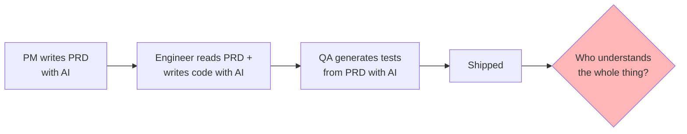

# Blog Post #3 — Plan: "Keep the Thinking"

**Status**: Plan v0.1 — awaiting Pranav's review before critic round
**Date**: 2026-06-10
**Source of thesis**: Pranav's own writing in `00_pranav_idea_original.txt` (copied from `04_blog_posts/idea_blog3.txt`). **His text is the spine of this post. The drafting rule is: his sentences survive; new material earns its place around them.**
**Supersedes**: `post_03_piotroski_cyclicals/` (shelved, unpublished) and `post_03b_multi_model_meta_experiment/` (deferred — repositioned as candidate Blog #4, see §9).

---

## 0. Why this post, and why it wins in a crowded genre

"AI is eroding critical thinking" is a saturated genre in mid-2026. Op-eds, LinkedIn posts, newsletter takes — the thesis alone is not differentiated.

What this post has that the genre doesn't:

1. **A public receipt.** The author built the exact thing the post warns about — an AI pipeline validating AI output — wrote a proud blog post about it (Blog #2, live on Medium), and was publicly corrected by a reader who spotted the structural flaw in one comment. Nobody else writing this genre piece has a timestamped, linkable example of themselves committing the error.
2. **The sharpest version of the receipt**: the five-agent pipeline produced 20+ findings per review round and looked *extremely* rigorous. Not one finding, across every round it ever ran, was "all five of us are the same model." The system was structurally incapable of seeing the thing about itself that one thinking human saw immediately. That single fact carries the entire "AI validating AI has no ground truth" argument without any hand-waving.
3. **Stakes that are real, not rhetorical.** The project domain is the author's own money. "The parts where being wrong is expensive" is not an abstraction here.
4. **An earned resolution.** Genre pieces end with "so stay vigilant." This post ends with a concrete division of labor the author actually uses now — what he still delegates to the agents (breadth) and what he keeps (the verdict). Readers get a usable heuristic, not a mood.

## 1. The one thing the reader leaves with

> **Use AI for the leverage. Keep the thinking.**

(Pranav's closing line, verbatim. It is the best line in the source file and it is the post.)

Supporting formulation, also his: *the premium skill won't be knowing how to use AI — everyone will know that. The premium skill will be knowing where **not** to use it.*

## 2. Audience & positioning

- **Primary**: every knowledge worker using AI at work — PMs, engineers, analysts, designers, students. Deliberately wider than the investing audience of Blogs #1–2. This is per Pranav's framing: "important for everyone to know."
- **Secondary**: the existing reader base from Blogs #1–2, for whom §"I did exactly this" is the payoff of the series arc.
- **Arc logic**: Blog #1 — "AI agrees with me too much; I'm building one that argues." Blog #2 — "here's how: five agents." Senior comment — "your five agents are one model in five hats." Blog #3 — "he was right, and the lesson is bigger than my project."
- Each post's flaw becomes the next post's subject. This also resolves the capitulation-vs-engagement problem that killed the previous Blog #3 plan: this post doesn't relitigate the senior comment point-by-point — it absorbs the critique into a larger thesis while naturally defending what the technique is still good for.

## 3. Title candidates

| # | Title | Notes |
|---|---|---|
| **1 (recommended)** | **The Skill That Survives AI Is Knowing When Not to Use It** | Pranav's own heading from the idea file. Declarative, complete claim, standalone-readable. |
| 2 | My AI Checked My AI. Neither Knew What "Right" Looks Like. | Receipt-forward; two-sentence tension structure (performed well for Blog #2's title). |
| 3 | Use AI for the Leverage. Keep the Thinking. | Most quotable; slightly vague as a cold title. Strong subtitle candidate instead. |
| 4 | Nobody on Your Team Fully Understands What You Just Shipped | Chain-problem-forward; PM-bait; punchy but doesn't carry the full thesis. |

**Recommended pairing**: Title 1 + subtitle carrying the receipt:
> *I built five AI agents to check my work. It took one human comment to spot what all five missed.*

Thesis in the title, receipt in the subtitle. Cold readers get both the claim and the reason to believe this author specifically.

## 4. Voice & provenance rules (strict)

- **Pranav's text from the idea file is the spine.** Sections marked **HIS** below survive maximally verbatim — light copyedit only (e.g., "Job candidates who uses agents to polished their resumes" → grammar fix). His rhythms stay: "So we skim. We approve. We move on." / "That's not efficiency. That's borrowed understanding." / "Use AI for the leverage. Keep the thinking."
- **New sections** (marked **NEW**) are written to match his register: direct, short sentences, no hedging filler, no em-dash chains, no "It's not X. It's Y." constructions (the known AI tell from prior critic rounds — note Pranav's own "That's not efficiency. That's borrowed understanding" is fine precisely because it's his).
- First person throughout. Simple English. No project jargon (no "Cycle B," no "v0.X," no "B.5").
- **Anonymization (hard rule, R5-informed)**: no company names anywhere. No numbers that de-anonymize prior work (no +355%/March-2020 combos). Senior commenter credited anonymously: "a thoughtful comment on my last post." Project references stay at Blog #2's abstraction level ("my investing math," "a risk-sizing formula").
- Tone: conviction, not humility-performance. This post is Pranav *asserting* something he believes. The "still learning" register of prior posts applies only to §6's admission beats, not the thesis.

## 5. Structure (7 sections, ~1,700–1,850 words)

### Hook (~90 words) — NEW, with confession beat

Draft:

> Say you're building an AI agent. You need to check that its output is right. So you use another AI to check it.
>
> Think about what's actually happening there. The thing that made the work is a model. The thing checking the work is a model. Neither one knows what "right" looks like. And because the output reads polished, the human in the loop doesn't look closely either.
>
> I'm not describing a hypothetical. I'm describing what I did — in public, in my last post.

(First two paragraphs are a tightened lift of HIS validation-loop paragraph; the confession beat is NEW. Hook lands the receipt by sentence 8, well inside Medium's bounce window.)

### §1 — Efficiency quietly became the only goal (~180 words) — HIS
- "Everyone around me is using AI to be more efficient. I do too. But somewhere along the way, efficiency quietly became the only goal, and we stopped asking what we're trading away for it."
- The validation-loop pattern completed: "When both sides of the loop are probabilistic, errors don't cancel out. They compound."
- Subhead candidate: **"Efficiency became the only goal"**

### §2 — I did exactly this (~320 words) — NEW (the receipt)
- 3-sentence recap of Blog #2 with link: five specialist agents critique my investing math, a sixth synthesizes; they've caught real things — a formula bug, a coverage gap.
- Then the comment arrived. A thoughtful reader pointed out what I'd missed: all five of my critics run on the same underlying model. Same training, same blind spots. The synthesizer reading their reviews? Also the same model. One model, cleverly prompted to argue with itself — with me feeling rigorous the whole time. His phrase for the general pattern applies to me exactly: borrowed understanding.
- **The kicker (this paragraph is the post's centerpiece)**: my pipeline produced twenty-plus findings every review round. It looked exhaustive. And in every round it ever ran, not one finding was "all five of us share the same blind spots." The system couldn't see the thing about itself that one human reader saw in minutes.
- One-sentence teaser redirect (Reader-critic requirement from prior round, now on-theme): "My last post promised a follow-up about an investing checklist. I shelved that draft — when I finally read it as a reader instead of as its builder, I didn't believe it enough to publish. Keep that decision in mind; it's where this post ends up."
- Subhead candidate: **"The bug none of my five agents could find"**

### §3 — The chain problem (~260 words) — HIS, plus one NEW bridge line
- PM writes the PRD with AI → engineer reads it with AI → QA generates tests from it with AI. "At the end of this chain, ask a simple question: who on this team actually understands every requirement and knows in detail what was built? Often, nobody."
- "Not because people are lazy, but because AI produces so much output, so fast, that reviewing all of it in its entirety is practically impossible. So we skim. We approve. We move on."
- "That's not efficiency. That's borrowed understanding, and the debt comes due at the worst possible time, in production, in front of a customer, in an edge case nobody thought about because nobody was really thinking."
- NEW bridge (one sentence, binds to his investing readers): the same chain runs in investing — a screener produces the list, an AI summarizes the filings, a decision gets made, and nobody in the chain ever read the annual report.
- Subhead candidate: **"Who actually understands what was built?"**

### §4 — The averaging-out (~170 words) — HIS
- Content homogenization: "technically fine and completely forgettable." "When everyone draws from the same models trained on the same data, the outputs converge. Originality doesn't die dramatically. It just gets averaged out."
- The creators who stand out are the unmistakably human ones.
- Subhead candidate: **"Averaged out"**

### §5 — The muscle (~150 words) — HIS
- Students who can't defend the essay. Candidates who can't justify the résumé. Designers with ten options and no reason. Analysts presenting summaries of reports they never opened.
- "None of these people got less capable overnight. They just stopped exercising the muscle. And critical thinking is exactly that — a muscle. It doesn't disappear when you use AI. It disappears when you stop doing the thinking yourself."
- Subhead candidate: **"The muscle"**

### §6 — What I now keep, and what I still delegate (~330 words) — NEW (the earned resolution)
This is what the genre pieces don't have: a concrete division of labor from someone who got burned.

- **What I still delegate — breadth.** The five agents still read my work from five angles and surface things I would never generate alone. Volume, coverage, tireless pattern-matching. The reader's comment didn't make that fake. (This is the natural, selective defense of Blog #2 — no relitigating needed.)
- **What I keep — the verdict.** Every findings list now ends with me, slowly, deciding which findings are real. Roughly one in ten of my agents' findings turns out to be a false alarm: plausible, confidently worded, wrong. Sorting those is not overhead on top of the work. It *is* the work.
- **What I keep — anything where being wrong is expensive.** For me that's the actual buy-or-sell judgment my whole project exists to inform. HIS line lands here: "(validation, judgment calls, original ideas, anything where being wrong is expensive) — and protecting those fiercely."
- Closing beat of the section: I also changed one small thing — when something checks my work, I now ask what the checker *can't* see. A model checking a model can't see their shared blind spots. That question is cheap. Not asking it was expensive.
- Subhead candidate: **"Keep the verdict"**

### §7 — Close (~140 words) — HIS, near-verbatim
- "In a world where AI-generated output is abundant and nearly free, the scarce thing, the valued thing, will be the opposite. Judgment. Original perspective. The ability to look at something and know whether it's actually right, not just whether it looks right."
- "Tomorrow's premium skill won't be 'knows how to use AI.' Everyone will know how to use AI. The premium skill will be knowing where not to use it."
- "I'm not arguing against AI. I use it every day, and I'd be slower without it. I'm arguing against outsourcing the one thing that makes your work yours."
- "**Use AI for the leverage. Keep the thinking.**"
- Final line, his, exactly: "Because in a few years, when everyone's output looks the same, the people who kept thinking for themselves will be the only ones with something different to say."
- Optional one-line forward tee (Pranav's call, see §9 decisions): "I'm re-running my five-agent setup with critics from different model families — whether that actually fixes the blind-spot problem is a future post."

**Word budget**: 90 + 180 + 320 + 260 + 170 + 150 + 330 + 140 ≈ **1,640** → lands ~1,700–1,850 after drafting breath. ~8 min read.

## 6. Diagram (one only)

One mermaid diagram, exported to PNG for Medium (mermaid code blocks do not render there — known constraint).

**The chain, with the question mark** (placed in §3):

A second candidate (the AI-validates-AI loop with "ground truth: nowhere" annotation) is available if critics argue §hook/§1 needs a visual, but default is **one** diagram — this post's power is prose rhythm, and Pranav's file is prose-driven.

## 7. Platform (Medium)

- **Tags**: Artificial Intelligence, Future Of Work, Productivity, Critical Thinking, Technology. **Note: no Investing tag** — deliberate widening beyond the series' usual audience. Flagged as a decision for Pranav (§9 Q4).
- No "Part 3" framing anywhere. Standalone-readable; Blog #2 linked inline in §2 where the receipt needs it.
- Subtitle does real work (see §3 title pairing).
- CTA: close on his final line, full stop. At most the one optional forward-tee sentence. No "follow me."

## 8. Risks

- **Genre fatigue** — mitigated by leading with the receipt (confession in the hook, §2 early), not the thesis.
- **Reads as retraction of Blog #2** — mitigated by §6's explicit "the agents still catch real things; what changed is what I do with their output."
- **Preachiness** — the §4/§5 examples (students, candidates, analysts) are about *other people*; the post earns the right to those examples only because §2 put the author first in line. Keep §2 before §4/§5 in any restructure.
- **AI-tell irony** — a post about keeping human thinking must read human. Provenance rule (his sentences survive) is the main defense; the critic round should include the Voice lens with this post's irony explicitly flagged.
- **Over-claiming the false-alarm stat** — "roughly one in ten" must stay soft ("roughly," "in my experience") — it's an observed rate across rounds, not a measured benchmark.

## 9. Decisions for Pranav before critic round

| # | Decision | Recommendation |
|---|---|---|
| Q1 | Title | #1 (his own heading) + receipt subtitle |
| Q2 | Structure | As outlined — his text as spine, receipt at §2, resolution at §6 |
| Q3 | Shelved-post aside in §2 (one sentence, on-theme) | Include |
| Q4 | Tags go wider than investing (drop Investing tag) | Yes — this post is deliberately for everyone |
| Q5 | Diagram count | One (the chain) |
| Q6 | Forward-tee to the cross-model experiment as future post (one sentence in §7) | Include — it converts the deferred multi-model post into a natural Blog #4 |
| Q7 | Senior commenter credit | Anonymous ("a thoughtful comment on my last post") unless he engages further |

After Pranav's review of this plan: 5-critic round (Reader / Editorial / Skeptic / Voice — with the irony flag / Medium-fit), synthesis, then draft. Same loop as Blogs #1–2.

---

**End of plan v0.1.**
