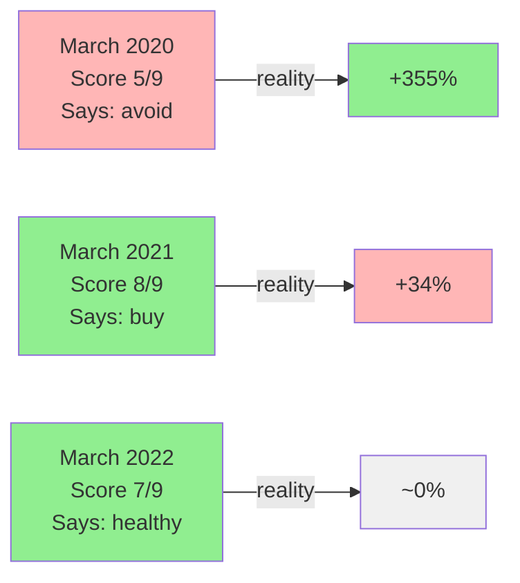
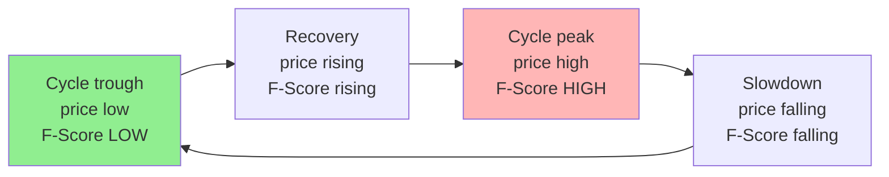

# A famous investing checklist gave me the opposite of the right answer

**Subtitle**: What I learned testing a popular investing framework on real Indian stocks — one stock at four dates, plus a supporting case.

---

A few months ago I built the Piotroski F-Score into my own investing system. It's a 9-point checklist many Indian investors swear by. I tested it on a real commodity stock at the bottom of its cycle. The score said: avoid this. The stock went up 355% over the next two years.

Then I tested the same checklist on the same stock at the top of its cycle, a year later. The score said: strong buy. The stock did nothing.

The checklist was giving me the opposite of the right answer.

---

## §1 — What this checklist is

Quick background, in case you haven't met it. A US professor named Joseph Piotroski invented this in 2000. He tested it on US value stocks and it worked well — companies scoring high on his 9-point checklist outperformed companies scoring low, on average, in the data he tested.

Each of the 9 questions asks if the company improved year-over-year on one front. Add up the yes/no answers. The score sits between 0 and 9. Score 8 or 9 is considered strong. 3 or below is considered weak.

The 9 questions, grouped:

| Group | Question | Pass if |
|---|---|---|
| Profitability | 1. Is the company making profit? | Net income > 0 |
| | 2. Is profit higher than last year? | This year > last year |
| | 3. Is it generating cash from operations? | Operating cash flow > 0 |
| | 4. Is cash flow bigger than profit? | OCF > Net income |
| Borrowing | 5. Has long-term debt gone down? | This year < last year |
| | 6. Can it pay short-term bills more easily? | Current ratio improved |
| | 7. Did it avoid issuing new shares? | Share count unchanged |
| Operations | 8. Has profit margin improved? | This year > last year |
| | 9. Is it using its assets more efficiently? | Asset turnover up |

The checklist is everywhere in Indian investing media. Books mention it. Premium screening tools rank stocks by it. People treat the high-score companies as buy candidates and the low-score ones as avoid.

I used it that way too, for years, before I tested it myself.

---

## §2 — How I tested it (and a disclosure I should make up front)

I picked **the Metals Stock** — one of the biggest commodity-producing names on the Indian exchange. Big company. Long history. Cyclical business — it does well when one specific commodity is in demand globally, struggles when it's not.

One important disclosure before the numbers. This is from my own hand-computation, not from peer-reviewed research. I tested one stock at four historical dates, plus one supporting case on another metals stock. That is a small sample. I am sharing what I saw, not claiming the matter is settled. I would genuinely like to hear from anyone who has tested this on more stocks.

I picked four dates that cover a full cycle: March 2020 (bottom), March 2021 (recovery), March 2022 (peak), March 2024 (calm-down). I computed each F-Score by hand from the company's annual reports. No shortcuts. Real numbers.

For each date I also tracked what the stock did over the next 24 months. That second part is what made the pattern obvious.

---

## §3 — The score said avoid. The stock tripled.

The results:

| Date | F-Score | What the score said | Stock over next 24 months |
|---|---|---|---|
| March 2020 | 5/9 | Mixed — be careful | **+355%** |
| March 2021 | 8/9 | Strong — buy candidate | +34% (matched the market) |
| March 2022 | 7/9 | Healthy | ~0% |

When the score was most excited (March 2021, score = 8), the stock did roughly nothing. When the score was least excited (March 2020, score = 5), the stock tripled.

Let me pause on the cleanest comparison — March 2021 versus March 2022. The March 2020 entry came right after the COVID crash, which means part of the +355% is the market recovering, not the stock specifically. A fair skeptic will press on this. But the same checklist at March 2021 (score 8) and March 2022 (score 7) — neither distorted by a macro event — still gave buy/healthy readings that produced almost no return. The March 2021 score of 8 was the most enthusiastic the F-Score had been about this stock in years, and the next 24 months returned almost nothing.

So I tested **another metals stock** at the same cycle dates. Same direction. F-Score highest near the peak, lowest near the trough. Forward returns inversely related — high score then poor returns, low score then strong returns. Not statistical proof. Two stocks is still a small sample. But the pattern shows up in more than one.

---

## §4 — The checklist reads where you are in the cycle, not how good the company is

This took me a while to make sense of. Here is what I think is happening.

For a stable business — a quality consumer staple, a private bank, an IT services company — "better today than last year" is real news. The business improved. The score correctly says: things got better. Investors generally follow.

For a commodity cyclical, "better today than last year" mostly means we're past the worst of the cycle by some quarters. The business looks stronger because the cycle is recovering, not because the company itself is fundamentally better. By the time the F-Score lights up, the cycle has done most of its move. The stock has already been bid up.

Here is the part I missed at first. Cyclical stocks at the bottom of their cycle often have high book-to-market ratios — they are literally the universe Piotroski designed the checklist for. He targeted distressed-value stocks with high B/M. So at first glance, a cyclical at its trough is exactly what the checklist was meant to evaluate.

The catch is that cyclicals recover for a different reason than value stocks do. A value stock recovers when the underlying business gets better. A cyclical recovers when the cycle turns. The F-Score is built to spot the first kind. It struggles with the second.

Piotroski's original paper was clear about its scope. The Indian investing community has used the framework more broadly than the original scope. That's not anyone's fault — frameworks travel. For one class of stock specifically, the travel doesn't carry over cleanly.

---

## §5 — A contrast: a stable business, where the score does work

For comparison I ran the same hand-computation on **the Consumer Goods Stock** — a large maker of household products on the Indian exchange. Stable demand. No commodity-cycle exposure.

I have to be honest about Stock Y — the data is messier than I'd like. The Consumer Goods Stock's 2020-2024 numbers are tangled up with a new competitor entering its market, which threw off both the F-Score and the share price during that window. So instead of inventing a clean controlled comparison, let me describe the principle.

For a stable business without major cyclical exposure, the F-Score generally moves with the business. A good year produces a high score. A bad year produces a low score. The stock follows over the relevant time horizon — not week-by-week, but over years. The score is doing what Piotroski designed it to do: rewarding genuine business improvement, penalising genuine business deterioration.

The "opposite of the right answer" problem doesn't show up here. Score and stock end up in roughly the same place.

For cyclicals — and for any company whose primary customer is housing, auto, construction, or commodities — score and stock end up in different places more often than not.

---

## §6 — How to spot when this might be biting you, and what I do about it

Quick checklist for where the F-Score might be reading the cycle instead of the company:

- Commodity producer (metals, oil & gas, fertilisers)
- Major customer is housing, auto, or construction
- Power and infrastructure
- Auto-component makers (ancillaries)

For everything else — FMCG, IT services, private banks, pharma, most of the NIFTY 100 — the F-Score appears to work closer to as intended, based on what I have tested so far.

For cyclical names where I still want a quality signal, I switched my own system to a 5-year-average version of the same questions. Instead of asking "is profit higher than last year?", it asks "is profit higher than the 5-year average?". Same idea for margin, cash flow, asset turnover. This smooths out the cycle. Cycle-bottom years stop looking catastrophically worse than cycle-peak years.

That's the programmer's version. If you are doing this manually on a screening tool like Screener.in or Tickertape, a simpler proxy: check whether the current year's operating margin is near the company's 5-year high. If it is, the F-Score is probably reading a cycle peak. If margin is near the 5-year low, the F-Score is reading a trough — and might be steering you away at exactly the moment you'd want to investigate.

I should be honest about one thing. I have not yet tested whether my 5-year version actually improves my entry timing on cyclicals. It addresses the mechanical problem — the score no longer inverts at troughs. The empirical question of whether the new version produces better decisions over time is still open. I'm working on it.

One related observation worth mentioning. A second part of my system, which uses price-action signals instead of fundamentals, showed the same kind of cyclical-trough inversion. Different math, same pattern. Whatever is going on with cyclicals at troughs is not unique to the F-Score — trailing signals in general appear to point the wrong way at exactly the wrong moment.

---

## §7 — What this taught me

A lot of investing math we use in India is imported from US research from the 1990s. Most of it works. Every now and then, a corner of it doesn't, and the corner has to be tested on real Indian stocks before you can find it.

I built my system partly because I wanted to test these corners. The F-Score blind spot for cyclicals is one. There are more — I will write the next ones as I find them and can describe them clearly.

If you have tested the F-Score on Indian cyclicals and seen a different pattern, or the same pattern with more stocks, I would genuinely like to hear about it. I am working from one stock at four dates plus one supporting case. More data is exactly what I need.

The first post in this series explains what I'm building and why.
