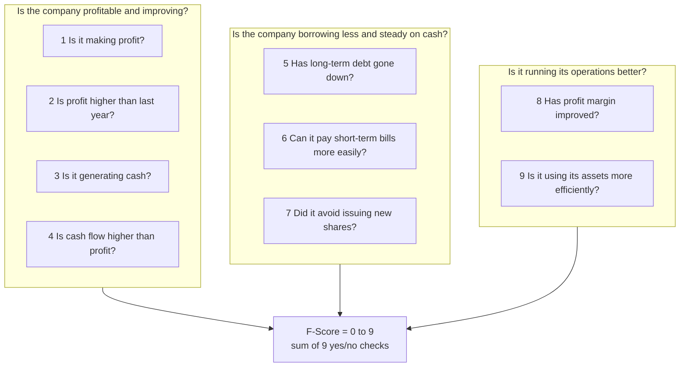
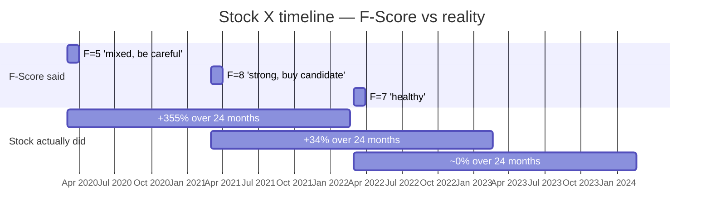
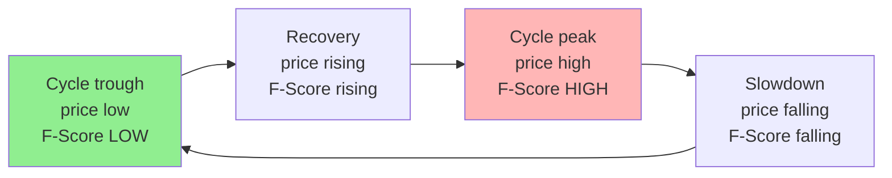

# Blog Post #3 — Plan

**Working title (3 candidates, pick one)**:
1. **"A famous investing checklist gave me the opposite of the right answer"** (recommended — punchy, curiosity-driven)
2. "The 9-point investing checklist that's wrong about an entire kind of Indian stock"
3. "I ran the most respected investing checklist on a real Indian stock. It told me to avoid the best buy of the decade."

**Audience**: Indian retail investors. The kind who reads Saurabh Mukherjea, Mohnish Pabrai, Soumya Kanti's YouTube, who's heard of the Piotroski F-Score and treats it as gospel. They WILL push back on this post — so the math has to be airtight.

**Length target**: 1800–2200 words (~9–10 min read). Longer than blog #2 because it has math to walk through.

**Voice constraints (same as blog #1 + #2, plus Pranav's specific feedback on this plan)**:
- First person.
- Simple English. Avoid: "Spearman correlation", "anti-correlation", "structural inversion". Use: "the opposite", "back-to-front", "facing the wrong way".
- Real company names → **Stock X** (the cyclical example — Tata Steel anonymized) AND **Stock Y** (non-cyclical contrast — Asian Paints in stable pre-2021 era, anonymized). **TWO stocks in this post (locked from Pranav feedback).**
- All diagrams in mermaid. None in ASCII or plain text. **More diagrams welcome (locked from Pranav feedback) — aim for 4-5, not 2.**
- Personal learning framing: "I was using this checklist. Then I tested it on a real stock. Here's what surprised me."
- No defensive framing.
- **🔑 TONE — "still learning, not done" (locked from Pranav feedback)**: This is the higher-stakes blog of the two — it makes a math claim. The tone CANNOT be "the checklist is wrong, I figured it out". It must be: "On the data I tested, this is what I saw. I'm still investigating. One stock at four dates isn't statistical proof. I'm sharing the pattern because it surprised me and I want to hear if others have seen the same or different. I'm a learner here, not the authority." Sentence-level cues throughout: "from what I'm seeing", "I might be wrong about this", "the data I have so far suggests", "would love feedback from anyone who's tested this on more stocks".
- **🔑 DISCLOSURE (locked from Pranav feedback)**: Explicit upfront disclosure that this is from my own personal work, not peer-reviewed research, and based on a small sample. Best placed in §1 (after the hook) or §3 (after the table). Pick during drafting; surface it BEFORE the reader concludes anything.

---

## The one thing this blog should leave the reader with

> **The F-Score tells you a company is doing well today. For some stocks, that's exactly when you don't want to buy.**

The reader should walk away understanding: a year-on-year-improvement signal is a coincident indicator, not a leading one. For mean-reverting cyclical stocks, that means it fires brightest at exactly the wrong moment.

---

## The hook (first 120 words — must hook a retail-investor reader by paragraph 2)

Draft (will refine in v0.2):

> If you read Indian investing books or watch the popular YouTube channels, you've probably heard about the Piotroski F-Score.
> It's a 9-point checklist. Score 8 or 9, and the company is supposedly a strong buy. Score 3 or below, and it's a sell.
> A few months ago I built it into my own investing system and tested it on real Indian stocks. The first few tests went fine.
> Then I tested it on a commodity stock at the bottom of its cycle. The score said: avoid this. The stock then went up 355% over two years.
> I tested it at the peak of the same cycle a year later. The score said: strong buy. The stock then matched the market — boring.
> The checklist is giving the opposite of the right answer for this kind of stock. Here's why, and here's what I do instead.

---

## Structure (7 sections)

### §1 — What this checklist is (in plain English) (~250 words)
- A US professor named Piotroski invented this in 2000. Tested it on US data; it worked.
- It's a 9-question checklist. Each question = 1 point if "yes", 0 if "no". Sum = the score.
- The questions ask: Is the company making more money this year than last? Is it generating more cash? Has it borrowed less? Has its profit margin improved? Etc.
- Score 8 or 9: company is improving on most fronts.
- Score 3 or below: company is deteriorating.
- It's widely used in Indian investing. Multiple Indian books mention it. Many premium screening tools rank stocks by it.

**Diagram 1**: Mermaid table-style visualization of the 9 questions, grouped into 3 categories (Profitability / Borrowing-and-Cash / Operations). Keep it simple — 9 rows, 3 sections.

### §2 — How I tested it on a real Indian stock (~300 words)
- I picked **Stock X**. It's one of the biggest names on the Indian exchange. Big company. Long history. Cyclical business — does well when one specific commodity is in demand globally, struggles when it's not.
- I tested it at 4 historical dates: March 2020, March 2021, March 2022, March 2024.
- I picked those dates because they cover the full cycle — a bottom, a recovery, a peak, and a calm-down phase.
- I computed the F-Score by hand from the company's annual reports. (No shortcuts. Real numbers.)
- I also looked at what the stock did over the next 2 years from each date.
- That second part is the kicker.

### §3 — What the numbers showed (~400 words — this is the heart of the blog)
- Table:

| Date | F-Score | What the score said | What the stock did over next 2 years |
|---|---|---|---|
| March 2020 | 5/9 | Mixed — neither buy nor sell. Don't get too excited. | +355% |
| March 2021 | 8/9 | Strong fundamentals. Buy candidate. | +34% (just matched the market) |
| March 2022 | 7/9 | Healthy. Buy candidate. | ~0% |
| March 2024 | 6/9 | Mixed. Watch. | (incomplete window, lagging) |

- The pattern: when the score was MOST excited (March 2021, F=8), the stock was about to do nothing. When the score was MOST cautious (March 2020, F=5), the stock was about to triple.
- Why? Because cyclical companies' fundamentals look weakest at the bottom of their cycle — that's literally what "bottom of the cycle" means. Margins are squeezed. Cash flow is poor. Asset turnover is bad. The F-Score sums up the "today" picture, and the "today" picture at the bottom is by definition ugly.
- A year later, when the cycle has turned and earnings are flowing again, the F-Score lights up — but the stock's already moved.

**Diagram 2**: Mermaid showing F-Score vs Stock Price over time as parallel timelines, with markers showing the inversion.

(Mermaid gantt might not be the best — could use a flowchart with up/down arrows instead. Will iterate during drafting.)

### §4 — Why this happens (the deeper "aha" moment) (~250 words)
- The F-Score asks: "Are things better today than they were last year?"
- For a stable quality business, "things better today than last year" is a real positive signal.
- For a cyclical business, "things better today than last year" just means "we're past the worst of the cycle — by some quarters."
- By the time the F-Score is telling you "things are improving", the smart money has already bid up the stock.
- It's not that Piotroski is wrong. It's that **he never said this was for cyclicals.** The original paper was about value stocks. The Indian investing community quietly extended it to all stocks. That extension is where the problem lives.

**Optional Diagram 3**: A simple cycle graphic — sine wave showing commodity cycle, with the "F-Score peaks" labeled at the wave peak and "F-Score troughs" at the wave trough, with the inverse correlation visible.

### §5 — Contrast: Stock Y, a non-cyclical (the F-Score works here) (~300 words)
- Walk through **Stock Y**: a large consumer-goods business on the Indian exchange. Stable demand. No major commodity exposure. Not tied to housing/auto/construction cycles.
- Hand-computed F-Score on Stock Y across a comparable 4-date window (illustrative — use stable pre-2021 era of Asian Paints anonymized, OR illustrative numbers if data is messy).
- Show the contrast table:

| Date | Stock Y F-Score | What the score said | What the stock did next 2 years |
|---|---|---|---|
| Year A | 7/9 | Healthy | Roughly matched the market |
| Year B | 8/9 | Strong | Outperformed |
| Year C | 5/9 (during a temporary slowdown) | Mixed | Mild dip then recovered |
| Year D | 7/9 | Healthy | Steady gains |

(Specific numbers to be confirmed during drafting; pattern is the point — for stable businesses, the F-Score moves WITH the stock, not against it.)

- For stocks like Stock Y, the F-Score is reading the **business condition**. Business condition and stock price stay roughly correlated over multi-year periods. Signal works.
- For stocks like Stock X (cyclical), the F-Score is reading the **cycle position**. Cycle position and stock price are anti-correlated near turning points. Signal breaks.

### §5b — How to spot a stock where F-Score might mislead (~150 words)
- Quick checklist for "F-Score might be reading the cycle, not the company":
  - Commodity producer (metals, oil and gas, fertilizers)
  - Major customer is housing, auto, or construction
  - Power and infrastructure
  - Auto-component makers (ancillaries)
- For these stocks, year-on-year improvement signals are coincident with the cycle peak.
- For everything else (FMCG, IT services, private banks, pharma — most of NIFTY 100), the F-Score appears to work closer to as intended (based on what I've tested so far).

### §6 — What I do instead (~250 words)
- For cyclical stocks specifically, I switched to a 5-year-average version of the same questions.
- Instead of "is profit higher than last year", I now ask "is profit higher than the 5-year average".
- Same idea for margin, cash flow, asset turnover.
- This smooths out the cycle. Cycle-bottom years no longer look catastrophically bad against cycle-peak years.
- It's not perfect. But it's better than the textbook version for this class of stock.
- I also surface a warning when the system computes an F-Score for a cyclical stock: "this score may be reading the cycle, not the company's quality. Check the commodity price trend separately."

### §7 — Closing — what this taught me about using imported math (~150 words)
- The original Piotroski paper was about US value stocks in 1996. Not Indian cyclicals in 2026.
- A lot of what we read in investing books is imported from US research. It mostly works. But every now and then it breaks in a way no Indian-investing book has tested.
- The way to find out is to test it on real Indian stocks before trusting it.
- This is what I'm doing for the whole system I'm building.
- (Closing line linking back to project) "If you want to follow along: [link to blog #1] explains what I'm building and why. [Blog #2 link] is about how I make the AI argue with itself to find these things."

---

## Diagrams needed (mermaid) — **4-5 diagrams (Pranav: "more diagrams welcomed")**

| # | Where | What | Style |
|---|---|---|---|
| 1 | §1 | The 9-point F-Score, grouped into 3 categories | Flowchart with 3 subgraphs feeding into Score |
| 2 | §3 | Stock X — F-Score over time vs forward returns | Side-by-side flowchart (top row = score, bottom row = actual outcome, arrows showing the inversion) |
| 3 | §4 | The cycle loop — why F-Score peaks at price peaks for cyclicals | Flowchart cycle (4 nodes in a loop, color-coded) |
| 4 | §5 | Stock Y (non-cyclical contrast) — F-Score over time vs forward returns | Same style as #2 but showing the "they line up" pattern |
| 5 (optional) | §5b | Quick visual "where F-Score works vs where it might mislead" | Two-column flowchart split |

Goal: 4-5 mermaid diagrams. The two-stock comparison (#2 vs #4) is the central visual argument.

---

## Examples to use (all anonymized) — **TWO stocks (locked from Pranav feedback)**

### Stock X — the cyclical example (the inversion)

| Example | Real source | Anonymized as |
|---|---|---|
| Mar-2020 trough, F=5, +355% forward | Tata Steel (from earlier hand-compute work) | **Stock X** — "one of the biggest metal-producing names on the Indian exchange" |
| Mar-2021 peak, F=8, +34% forward | Tata Steel same | **Stock X** continued |
| Mar-2022, F=7, ~0% | Tata Steel | Stock X |
| Mar-2024, F=6, recent | Tata Steel | Stock X (full timeline) |

### Stock Y — the non-cyclical contrast (where F-Score works)

| Example | Real source | Anonymized as |
|---|---|---|
| 4 dates across a stable era | Asian Paints (from earlier hand-compute work, pre-competitive-disruption window) | **Stock Y** — "a large consumer-goods business with stable demand" |

(If Asian Paints' specific numbers don't tell a clean "F-Score worked" story across the dates we have data for, fall back to illustrative numbers in §5 — the pattern is what matters, not the exact figures. Be explicit in the post if numbers are illustrative.)

---

## What success looks like

If a reader:
- Stops blindly trusting the F-Score on metals/auto stocks → win
- Tests the math themselves on a stock they own → big win
- Argues with the post in the comments → fine — engagement is good as long as the math holds
- Shares it with someone who's about to buy a "high F-Score" cyclical → biggest win

If a reader thinks I'm trashing Piotroski — that's a fail. The post is "the textbook is right for what it was designed for; here's the corner where it breaks". Not "this is bad math".

---

## Risks / things to watch

- **Pushback from F-Score evangelists**: be precise. Don't overclaim. The data is from one stock at 4 dates — say so.
- **Math anxiety**: keep the formulas out of the prose. The 9 questions in plain English are enough. No greek symbols. No "Σ".
- **Sounding contrarian for its own sake**: the tone is "I found this surprising; here's the data". Not "everyone else is wrong; I figured it out".
- **One-stock evidence**: acknowledge this in §3. "I tested it on one stock at 4 dates. That's not statistical proof. But the pattern lines up with how cyclicals work in theory, so I think the finding will hold."
- **Overgeneralization**: the post is about cyclicals specifically. Don't let the headline imply "the F-Score is broken everywhere". Section §5 explicitly limits the scope.

---

## Pranav's review (locked decisions)

1. **Title pick** — open to discussion; will revisit after reviews and draft.
2. **Two stocks** — Stock X (cyclical) + Stock Y (non-cyclical contrast). ✅ Locked.
3. **Disclose "from my own work, not peer-reviewed"** — yes. ✅ Locked.
4. **Diagrams** — 4-5 welcome (more is better here). ✅ Locked.
5. **Length** — 1800–2200 stretches to 2000–2500 with the second stock + extra diagrams.
6. **Publication order** — Blog #2 first, then this. ✅ Locked.
7. **Tone — "still learning, not final"** — pervasive throughout. ✅ Locked.

Next step: 5 critic agents (target reader / editorial / skeptic / voice authenticity / Medium-fit) review this plan. Their feedback informs the draft. Pranav reviews the draft.
