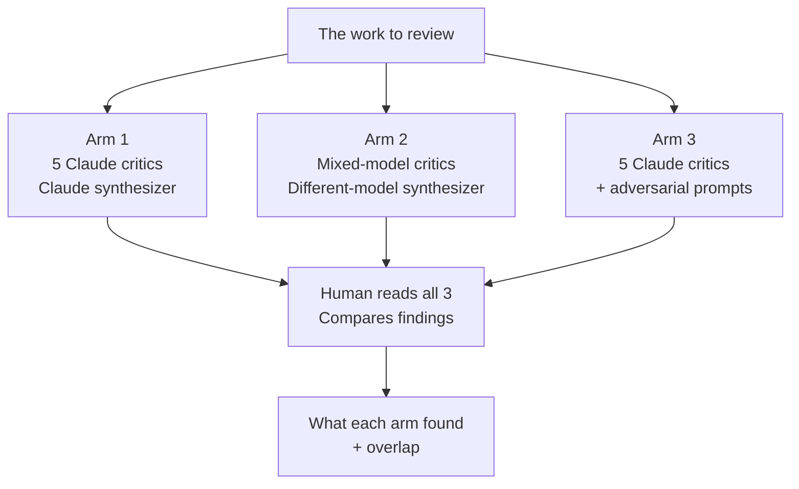

# Blog Post #3 (replacement) — Plan v0.3

**Status**: Plan draft. Replaces shelved F-Score cyclical inversion blog.
**Theme**: **Part 3 of the project arc** — continues directly from Blog #1 (why I'm building this) and Blog #2 (the multi-agent critique technique). Responds to concerns + suggestions raised across both prior posts, integrates external sources Pranav surfaced, and updates methodology based on careful reasoning (not empirical data we don't yet have).
**Trigger**: Senior comment on Blog #2 + open questions left by Blog #1 + Pranav's 2 referenced tweets (pending content) + agent-patterns library.
**Framing locked**: **Continuation + accountability.** "Soft theory test" — we reason about the critique in depth, design the experiment we would run, update methodology where we're confident, and explicitly acknowledge what we still don't know — without pretending to have empirical results from a multi-model run we haven't done.

---

## Working title (5 candidates, pick one)

The title should hint at "continuation" without screaming "Part 3."

1. **"Two posts in, here's what the comments taught me"** (recommended — naturally signals continuation + accountability)
2. "I wrote two posts about my investing-bot project. Then the real feedback started."
3. "A senior pushed back on my AI agent post. Here's what I think about it."
4. "The unfixable problem with one model critiquing itself — and what I'm doing about it"
5. "Update on the project — and the critique I had to take seriously"

---

## The one thing this blog should leave the reader with

> **A model critiquing itself five times is not the same as five different perspectives. I knew that intuitively. A reader spelled out exactly why. Here is the thinking I went through about it.**

This blog is about **engaging with criticism in good faith**, not about proving anyone right or wrong with data we don't have. The tone is "I took this seriously, reasoned it through, and here's where I landed."

---

## Audience

Same Indian retail investor + builder mix as Blog #2. The builder lean is slightly stronger because the topic is methodology. The post still works for a retail reader — they'll skim the methodology detail and focus on §3 (why the critique lands), §6 (what I'm changing now), and §7 (what I still don't know).

---

## Length target

1500–1800 words. ~7–8 min read. Shorter than originally planned because there's no empirical data section to walk through.

---

## Voice constraints (consistent with Blogs #1, #2)

- First person
- Simple English; avoid: "inductive bias", "training distribution", "structural inversion". Use: "same model means same blind spots", "different models notice different things"
- All companies → variables ("the Metals Stock") if any come up — though this blog won't need many
- AI model names — use real names (Claude, Gemini, GPT) — they're the subject matter
- The senior commenter — credit but anonymize ("a thoughtful reader") unless they consent to being named
- Mermaid diagrams for design schematics
- **"Still learning" tone — stronger than usual**: This post explicitly doesn't claim empirical results. The framing IS reasoning + design + what-I'm-confident-about. Authoritative voice would be dishonest. Look for sentence-level cues throughout: "I think", "as far as I can tell", "what I'd expect", "I haven't actually run this yet", "would love to hear from anyone who has".

---

## The hook (5-sentence lede draft)

> I've written two posts about this project so far — one about why I'm building a personal AI to argue with me about my own portfolio, and one about the technique I use to make the AI actually push back. Both posts got real feedback. A thoughtful comment on the second post in particular pointed out something I hadn't quite let myself see: when all five agents I describe run on the same model, they share the same blind spots. The technique might be doing less work than I'd claimed. This post is me sitting with that — and with the other questions both posts left open.

The lede sets up three things: this is part 3 of an arc; the feedback was real; I'm engaging with it honestly.

---

## Structure (8 sections)

### §1 — Where we are in the project arc (~200 words)
- This is the third post about the project. Link Blog #1 and Blog #2 inline (not just at the close).
- One paragraph each:
  - **Blog #1** was about **why** — I want to argue with my portfolio decisions before I act on them, and most AI tools just agree with me. I'm building one that won't.
  - **Blog #2** was about **how** — the multi-agent critique technique. Five specialist agents + a synthesizer catching things a single AI misses.
- The arc lands here: real feedback came in on both posts. Some questions I'd left open. One critique that needed careful engagement. This post is the update.

### §2 — The open questions from the first two posts (~300 words)
- This is the "answering my own homework" section. Walk through 3-4 specific concerns/suggestions that came back across both blogs:
  - **From Blog #1** (placeholder — needs Pranav's input on actual reader feedback): e.g., "people asked whether I'm actually using this on my real portfolio yet", "people asked what the bot can see that I can't"
  - **From Blog #2**: the senior comment (the big one — gets its own section §3)
  - **From Blog #2**: smaller suggestions — adversarial prompts as an alternative, references to the agent-patterns research community
  - **From external sources Pranav surfaced**: the agent-patterns library, the two tweets (once content shared)
- One sentence per concern in this section. The detailed engagement is in §3-§5.

### §3 — The critique that needed the most engagement (~300 words)
- Quote the senior commenter directly (with their permission if available, or credited as "a thoughtful reader's comment" anonymously).
- Three concerns spelled out plainly:
  - Same model underneath = same blind spots, regardless of which role each instance is playing
  - The synthesizer is also the same model — so the pipeline is one model reading its own critiques
  - Role prompting creates **false confidence**: a "CTO agent" sounds more authoritative without being more correct
- The honest reaction: this is not a small critique. It points at the structural assumption the entire technique rests on.

### §4 — Why the critique is structurally right (~250 words)
- I worked through it carefully. Three points stood up:
  - **Yes** — same model means same training data, same compression, same blind spots. A Claude pretending to be a quant and a Claude pretending to be a behavioural critic are pulling from the same underlying source. Different slices, same well.
  - **Yes** — the synthesizer running on Claude reading critiques from Claude is closer to "self-confirmation with extra steps" than I'd want to admit.
  - **Yes** — when an LLM plays an authoritative role, it produces more confident outputs. Confidence is not correctness.
- One nuance I think is worth adding: the technique still does *something* — the role boundaries are real, even if the model behind them is the same. The question isn't "useless or useful." It's "how much of the value is real, and how much is theatre."

### §5 — The fixes that were proposed — what I think about each (~400 words)
The commenter proposed three fixes. I went through each.

- **Cross-model diversity** (one critic on Gemini, one on GPT, one on Claude, etc.):
  - This is structurally the strongest fix. Different model families = different training data = different blind spots.
  - But it's expensive operationally — multiple API access, prompt engineering per model family, output-format normalization.
  - My current take: **this is the right fix, but it has a cost. For a personal-research project like mine, the cost is real.**

- **Adversarial framing** (prompt rules that prohibit agreement):
  - Cheaper to implement than cross-model. Same critique pipeline, different prompts.
  - But: telling a model "you must find faults" produces noise as much as signal. Plausible-sounding objections that don't survive scrutiny.
  - My current take: **partial fix. Use it for the synthesizer step specifically (where confirmation bias is highest), not for every critic.**

- **Human-as-arbiter**:
  - I was already doing this — I read every synthesis and decide what to act on. The critic outputs are priority lists, not verdicts.
  - But I'd been treating it as a footnote. The senior comment makes me think it should be the headline.
  - My current take: **this is non-negotiable. Without a human challenging the synthesis, the whole pipeline is one model arguing with itself.**

### §6 — The experiment I'd run if I had the budget (~300 words)
- I'd take a specific piece of work I've already had reviewed (the technical-analysis math from earlier in the project) and run it through three parallel review pipelines:
  - **Arm 1**: 5 Claude critics + Claude synthesizer (the Blog #2 baseline)
  - **Arm 2**: mixed-model critics (Claude + Gemini + GPT) + a different-model synthesizer
  - **Arm 3**: 5 Claude critics with adversarial prompts + Claude synthesizer
- I'd be the human arbiter reading all three.
- I'd count: which catches surfaced in each arm; which were shared; which were unique.
- That's the experiment.

**Diagram 1** (the experimental design):

- I haven't actually run this yet. It needs multi-model API access I don't currently have set up. So: design, not data. If anyone with the right setup wants to run it, please do — and tell me what you find.

### §7 — What I'm changing right now, without waiting for the experiment (~300 words)
There are things I am willing to change immediately, based on reasoning alone:

1. **The synthesizer step specifically gets adversarial framing.** Instead of "synthesize the five reviews," the prompt becomes something like: "find the disagreement between these five reviews. Where they overlap, ask whether they're confirming each other or compounding the same blind spot." This is cheap, immediate, and addresses the self-confirmation problem head-on.

2. **The "human-as-arbiter" step gets a written checklist.** Instead of relying on my judgment to filter the synthesizer's priority list, I write down what I'm looking for: where do the critics agree because they're confirming a real signal vs. agreeing because they share a blind spot? This forces me to slow down and apply human reasoning where the pipeline most needs it.

3. **Cross-model is on the "as soon as practical" list.** I haven't done it yet. I will, when I can.

4. **The original Blog #2 advice still mostly stands** — but with explicit caveats: same-model multi-agent setups are best for breadth of perspective and scope-keeping, not for catching deep structural errors. For deep errors, you need either cross-model or a human who's willing to challenge the synthesizer.

### §8 — What I still don't know + an invitation (~150 words)
- I haven't measured the gap. I don't know how much value cross-model adds vs. same-model. I have reasoning, not data.
- I don't know if adversarial framing produces real catches at the rates I'd want.
- I don't know what model-family blind spots look like specifically — Claude is good at X but bad at Y; Gemini is different; I haven't mapped this.
- Open invitation to anyone running similar setups in production, especially with cross-model arms — what have you actually found?
- One last thing: huge thanks to the commenter. This kind of pushback is exactly what makes building in public worth it.

---

## Diagrams needed

| # | Where | What |
|---|---|---|
| 1 | §5 | Three-arm experimental design (flowchart TB) |
| 2 (optional) | §3 or §4 | A simple "five agents, same well" visual showing same-model blind spots |

Keep diagrams to 1–2 max. Mermaid renders weakly on Medium; export as PNG.

---

## What is and isn't claimed in this post

| Claimed | NOT claimed |
|---|---|
| The senior commenter's critique is structurally right | We've empirically validated the cross-model alternative |
| Cross-model diversity is the strongest theoretical fix | We've measured how much value it adds |
| Adversarial framing helps for the synthesizer specifically | We've measured its catch rate |
| Human-as-arbiter is non-negotiable | Other people will reach the same conclusion |
| I'm changing methodology in three specific ways now | These changes are tested and proven |

The post is honest about the difference between "I think this is right" and "I have data showing this is right."

---

## Pranav's decisions needed before drafting

1. **Title pick** — recommend #1 ("A senior pushed back on my AI agent post. Here's what I think about it.")
2. **Credit the commenter** — anonymous ("a thoughtful reader's comment") OR ask them for permission to name
3. **Diagram count** — 1 (experimental design only) or 2 (add a "same-well" visual)?
4. **Tone calibration** — recommended "I think / as far as I can tell / I haven't actually run this yet" cadence. Confirm OK or want even softer ("I might be wrong about all of this")?
5. **Mention the 2 tweet sources** — once their content is shared, decide whether they inform §4 or §6 specifically
6. **Length** — 1500–1800 OK?
7. **Closing thanks to the commenter** — included by default. Want to keep or cut?

Once locked → 5 critics review THIS plan → draft based on reviews → Pranav reviews draft → publish.

---

## Risks

- **Sounds like a retraction**: if poorly worded, the post reads as "Blog #2 was wrong." It isn't. Frame §3 as "the critique is right about the structural gap; the technique still does useful work."
- **Sounds like we're proving the critic right just to look thoughtful**: avoid by spelling out which parts of the original advice still hold up (§4 last bullet + §6 §4).
- **Authoritative-tone drift**: writing about methodology naturally pulls toward declarative. Keep "I think / as far as I can tell / I haven't actually run this yet" cues throughout.
- **Self-flagellation tone**: thanking the commenter once at the end is fine. Multiple times = performative humility (an AI tell). Once, sincere, at the close.
- **Missing the empirical step might disappoint a builder audience**: address head-on in §5 — "I'd run this if I could; here's the design; I'd welcome anyone running it."
